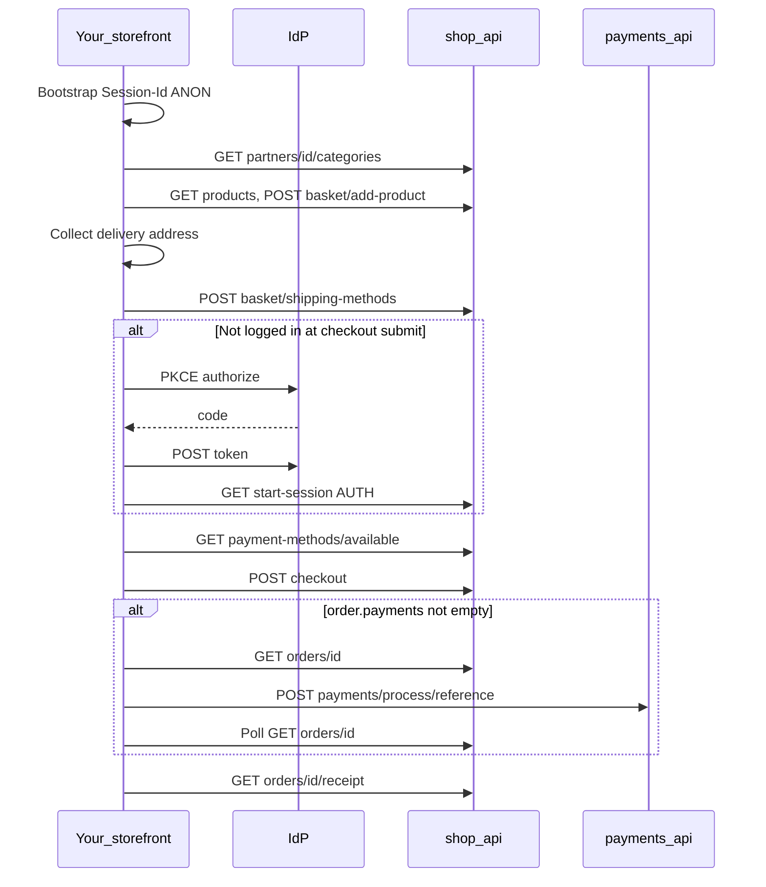

# Fikashop storefront integration

Build a **single-partner** storefront against **fikashop-api**: browse menu → cart → shipping → checkout → pay → orders.

**Canonical guide:** [docs/storefront-integration.md](docs/storefront-integration.md) — full payloads and edge cases.

**Fast path:** [contracts/INTEGRATION.md](contracts/INTEGRATION.md) — bootstrap through orders.

**Reference client:** [docs/reference-client-map.md](docs/reference-client-map.md) — screen-to-API map and client module behaviors (self-contained).

## Three API roots

| Root | Example | Used for |
|------|---------|----------|
| `{OIDC_ISS}` | `https://oidc.fikachu.com` | Authorize, token, refresh, userinfo |
| `{API_BASE}/shop/api/` | `https://api.fikachu.com/shop/api/` | Catalog, basket, checkout, orders |
| `{API_BASE}/payments/` | `https://api.fikachu.com/payments/` | `POST …/process/{reference}/` — **not** under `shop/api` |

## Required headers (shop)

| Header | Rule |
|--------|------|
| `X-Partner-Id` | **Required** on every `/shop/api/` call (`{PARTNER_ID}` = numeric id or partner `code`) |
| `Session-Id` | **Required** for cart/checkout — `SID:{ANON\|AUTH}:{api_hostname}:{uuid}`; persist UUID; flip `ANON`→`AUTH` on login |
| `Authorization: Bearer` | Required for orders, addresses, `start-session`; optional for catalog/cart per deployment |
| `Content-Type` / `Accept` | `application/json` on JSON bodies |

Partner resolution order: `?partner=` → `X-Partner-Id` → session `partner_id`. Fixed storefronts: header alone is enough.

## Customer journey

| Phase | Key endpoints | Skill detail |
|-------|---------------|--------------|
| Bootstrap | Persist `Session-Id`; optional `GET /auth/api/user/` | [INTEGRATION.md §1](contracts/INTEGRATION.md#1-bootstrap) |
| Store home | `GET /partners/{PARTNER_ID}/categories/` | [CATALOG.md](contracts/CATALOG.md) |
| Collections | `GET /ranges/`, `GET /products/?range=` (optional) | [CATALOG.md](contracts/CATALOG.md#product-groups-ranges) |
| Product | `GET /products/{id}/` | [CATALOG.md](contracts/CATALOG.md) |
| Cart | `GET /basket/`, `POST /basket/add-product/` | [INTEGRATION.md §3](contracts/INTEGRATION.md#3-basket) |
| Promo code | `POST /basket/add-voucher/` (optional) | [INTEGRATION.md](contracts/INTEGRATION.md#voucher-promo-code) |
| Address | Local geocode; `POST /basket/shipping-methods/` | [INTEGRATION.md §4](contracts/INTEGRATION.md#4-shipping) |
| Login | OIDC PKCE → `GET /shop/api/start-session/` | [INTEGRATION.md §1](contracts/INTEGRATION.md#1-bootstrap) |
| Checkout | `GET …/payment-methods/available/`, `POST /checkout/` (basket **id or URL**) | [INTEGRATION.md §5](contracts/INTEGRATION.md#5-checkout) |
| Pay | `GET /orders/{id}/`, `POST /payments/process/{reference}/` | [INTEGRATION.md §6](contracts/INTEGRATION.md#6-payment-capture) |
| Done | `GET /orders/{id}/`, `GET …/receipt/` | [ORDERS.md](contracts/ORDERS.md) |
| Digital | `GET …/digital-assets/`, `GET …/orders/{id}/assets/` | [DIGITAL-ASSETS.md](contracts/DIGITAL-ASSETS.md) |

**UI gates:** `partner.is_open`, `min_order_amount` vs basket total, delivery address + `location` coords, single-partner cart.

## Workflow routing

| Task | Read first | Fixtures / examples |
|------|------------|---------------------|
| Onboarding | [docs/GETTING-STARTED.md](docs/GETTING-STARTED.md) | [curl/](docs/examples/curl/) |
| Auth headers by screen | [AUTH-SCREENS.md](contracts/AUTH-SCREENS.md) | — |
| HTTP client + env | [INTEGRATION.md §1](contracts/INTEGRATION.md#1-bootstrap) | [client-setup.ts](docs/examples/client-setup.ts) |
| OIDC + session merge | [INTEGRATION.md §1](contracts/INTEGRATION.md#1-bootstrap) | [oidc-pkce-flow.md](docs/examples/oidc-pkce-flow.md) |
| Catalog / modifiers | [CATALOG.md](contracts/CATALOG.md) | [product-detail-modifiers.json](contracts/fixtures/product-detail-modifiers.json) |
| Product groups | [CATALOG.md](contracts/CATALOG.md#product-groups-ranges) | [list-ranges.sh](docs/examples/curl/list-ranges.sh) |
| Add to cart | [INTEGRATION.md §3](contracts/INTEGRATION.md#3-basket) | [add-to-cart.ts](docs/examples/add-to-cart.ts) |
| Promo / voucher | [INTEGRATION.md](contracts/INTEGRATION.md#voucher-promo-code) | [add-voucher.sh](docs/examples/curl/add-voucher.sh) |
| Payment fields | [PAYMENT-FIELDS.md](contracts/PAYMENT-FIELDS.md) | [payment-methods-available.json](contracts/fixtures/payment-methods-available.json) |
| Checkout | [INTEGRATION.md §5](contracts/INTEGRATION.md#5-checkout) | [checkout-flow.ts](docs/examples/checkout-flow.ts), [guest-checkout.ts](docs/examples/guest-checkout.ts), [wallet-checkout.ts](docs/examples/wallet-checkout.ts), [checkout-request-by-id.json](contracts/fixtures/checkout-request-by-id.json) |
| Orders / receipt | [ORDERS.md](contracts/ORDERS.md) | [order-detail.json](contracts/fixtures/order-detail.json), [order-receipt.json](contracts/fixtures/order-receipt.json) |
| Capture | [INTEGRATION.md §6](contracts/INTEGRATION.md#6-payment-capture) | [payment-capture.ts](docs/examples/payment-capture.ts) |
| Digital downloads | [DIGITAL-ASSETS.md](contracts/DIGITAL-ASSETS.md) | [digital-assets.ts](docs/examples/digital-assets.ts), [product-detail-digital.json](contracts/fixtures/product-detail-digital.json) |
| Endpoints | [ENDPOINTS.md](contracts/ENDPOINTS.md) | — |
| Errors | [ERRORS.md](contracts/ERRORS.md) | [docs/TROUBLESHOOTING.md](docs/TROUBLESHOOTING.md) |
| Production | [PRODUCTION.md](contracts/PRODUCTION.md) | [CHECKLIST.md](contracts/CHECKLIST.md) |
| Reference client | [reference-client-map.md](docs/reference-client-map.md) | — |

## Checkout → payment routing

| `order.payments` | Next step |
|------------------|-----------|
| `length > 0` with actionable status | Payment screen → `POST {API_BASE}/payments/process/{payments[].reference}/` |
| `length === 0` | Order confirmation (typical **cash on delivery**) |

Status sets: [contracts/status-map.json](contracts/status-map.json).

## Pitfalls

- Missing **`Session-Id`** — cart will not persist.
- Rotating UUID on login — call `start-session` with same UUID, flip `ANON`→`AUTH`.
- **`/payments/process/`** is under `{API_BASE}/payments/`, not `shop/api`.
- Checkout has **no idempotency key** — disable double-submit.
- **`complete-deferred-payment`** is **staff-only** — cash often returns `payments: []`.
- Country: **ISO-2** (`"TZ"`). `location.coordinates`: **`[longitude, latitude]`**.
- Single-partner cart — clear before switching `{PARTNER_ID}`.

## Local dev

| Item | Value |
|------|-------|
| API | `http://127.0.0.1:8076` |
| Demo partner | `X-Partner-Id: 1` |
| OpenAPI | `{API_BASE}/docs/` |

## Out of scope

[OUT-OF-SCOPE.md](contracts/OUT-OF-SCOPE.md). Subscriptions and wallet top-up are out of scope — coordinate with your FikaChu operator.
