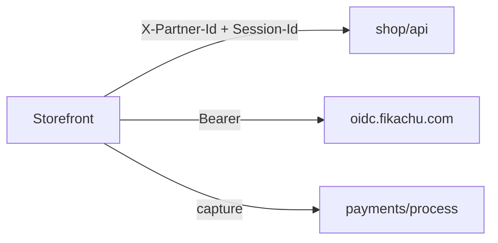

# Fikashop storefront — integration contract

Agent fast path distilled from [docs/storefront-integration.md](../docs/storefront-integration.md). Use with fixtures in [fixtures/](fixtures/).

**Also see:** [CATALOG.md](CATALOG.md) · [PAYMENT-FIELDS.md](PAYMENT-FIELDS.md) · [DIGITAL-ASSETS.md](DIGITAL-ASSETS.md) · [ORDERS.md](ORDERS.md) · [AUTH-SCREENS.md](AUTH-SCREENS.md) · [CHECKLIST.md](CHECKLIST.md)



---

## 1. Bootstrap

### Environment

| Variable | Example | Purpose |
|----------|---------|---------|
| `API_BASE` | `https://api.fikachu.com` | Shop + payments host |
| `OIDC_ISS` | `https://oidc.fikachu.com` | IdP |
| `OIDC_CLIENT_ID` | `your-client-id` | OAuth2 public client (PKCE) |
| `OIDC_REDIRECT_URI` | `https://your-store.com/auth` | Must match IdP registration |
| `PARTNER_ID` | `1` or `demo-kitchen` | `X-Partner-Id` on every shop call |

### Session-Id

Format: `SID:{ANON|AUTH}:{api_hostname}:{uuid}`

- `api_hostname` = hostname from `API_BASE` without port.
- Generate UUID v4 once per device/browser; **persist** in `localStorage` / `AsyncStorage`.
- On login: **keep UUID**, change `ANON` → `AUTH`, call `GET /shop/api/start-session/`.
- On logout: clear tokens; **new** anon session.

Fixture: [start-session.json](fixtures/start-session.json)

### HTTP client pattern

Every shop request:

```
X-Partner-Id: {PARTNER_ID}
Session-Id: {SESSION_ID}
Accept: application/json
Authorization: Bearer {ACCESS_TOKEN}   # when authenticated
```

Optional `?partner={PARTNER_ID}` on basket, add-product, checkout, payment-methods (mirrors reference client behavior).

### Bootstrap sequence

1. Load/create `Session-Id` (ANON).
2. Set `X-Partner-Id` on client.
3. If stored access token → set Bearer + AUTH session header.
4. If logged in: `GET /auth/api/user/` and/or `GET /shop/api/start-session/`.
5. On `401`: refresh via `{OIDC_ISS}/token/` (`grant_type=refresh_token`); retry once.

### OIDC (summary)

| Step | Endpoint |
|------|----------|
| Discovery | `GET {OIDC_ISS}/.well-known/openid-configuration` |
| Authorize | `GET {OIDC_ISS}/authorize/` — code + PKCE S256, scopes `openid profile email phone offline_access` |
| Token | `POST {OIDC_ISS}/token/` — `authorization_code` or `refresh_token` |
| Userinfo | `GET {OIDC_ISS}/userinfo/` |

### Start session (merge basket)

```http
GET /shop/api/start-session/
X-Partner-Id: {PARTNER_ID}
Authorization: Bearer {ACCESS_TOKEN}
Session-Id: SID:AUTH:{hostname}:{uuid}
```

Response: `{ "user": { … }, "basket_id": 17 }`. Returns `405` if not logged in.

### Login gate at checkout (reference app)

Mobile **always** requires login before `POST /checkout/`:

1. On submit while logged out → redirect to OIDC (do not checkout yet).
2. Preserve form in return URL (`is_preview=true&full_name=…`).
3. After token exchange → `start-session` → return to checkout → submit.

API may allow guest checkout when `OSCAR_ALLOW_ANON_CHECKOUT` is enabled; still recommend login for order history.

---

## 2. Catalog

### Store homepage

```http
GET /shop/api/partners/{PARTNER_ID}/categories/
```

Returns partner profile + category tree (categories with stock for this partner).

**UX fields:** `is_open`, `opening_hours`, `min_order_amount`, `allow_shipping`, `allow_store_pickup`, `allow_dine_in`.

### Partner profile only

```http
GET /shop/api/partners/{PARTNER_ID}/
```

### Products

```http
GET /shop/api/products/?page=1&size=15
GET /shop/api/products/{id_or_slug}/
```

Pagination envelope: `{ page, count, total_pages, results: [...] }`. Default `size=15`, max `10000`.

Catalog list/detail: `Session-Id` recommended; Bearer optional for anonymous browse.

### Product groups (ranges) — optional

Public curated shelves (Oscar ranges marked `is_public`). Requires partner scope.

```http
GET /shop/api/ranges/?partner={PARTNER_ID}
GET /shop/api/ranges/{id}/?partner={PARTNER_ID}
GET /shop/api/products/?partner={PARTNER_ID}&range={id_or_slug}&is_public=true
```

Full contract: [CATALOG.md](CATALOG.md#product-groups-ranges). Management stays on `/shop/api/admin/ranges/` (staff only).

---

## 3. Basket

### Get basket

```http
GET /shop/api/basket/
GET /shop/api/basket/?partner={PARTNER_ID}&payment_method_code=mpesa&shipping_method_code=standard
```

Pass `payment_method_code` + `shipping_method_code` on refresh so totals include surcharges. Fixture: [basket.json](fixtures/basket.json)

### Add product

```http
POST /shop/api/basket/add-product/
```

```json
{
  "id": 42,
  "quantity": 1,
  "options": [{ "option": "special-instructions", "value": "No onions" }],
  "modifier_groups": {
    "3": [{ "id": 18081, "quantity": 1 }]
  }
}
```

| Field | Rules |
|-------|-------|
| `id` or `url` | One required; `id` = numeric id, slug, or UPC; `url` = product detail URL |
| `options` | `option` = code, id, or URL segment; `value` = string |
| `modifier_groups` | Keys = group id; values = `{ id, quantity }[]` |

### Update / remove line

```http
PATCH /shop/api/baskets/{basket_id}/lines/{line_id}/
DELETE /shop/api/baskets/{basket_id}/lines/{line_id}/
```

Append `?partner={PARTNER_ID}` when mirroring mobile.

### Voucher (promo code)

Apply a partner-scoped promo code to the session basket. Requires `Session-Id` and partner context (`X-Partner-Id` / `?partner=`).

```http
POST /shop/api/basket/add-voucher/
Content-Type: application/json

{ "vouchercode": "WELCOME10" }
```

| Rule | Detail |
|------|--------|
| Body | `vouchercode` (string, required). Server uppercases the code. |
| Partner | Code must belong to the current partner; missing partner → validation error. |
| Success `200` | **Voucher** object (not the full basket). Refresh with `GET /basket/` to read `voucher_discounts` and updated totals. |
| Failure `406` | Unknown / expired / not available to user, or basket does not qualify for a discount. Body is field errors or `{ "reason": "…" }`. |

**Client flow:** POST add-voucher → on `200`, `GET /basket/?partner=…` (optionally with payment/shipping method codes) → show `voucher_discounts[]` (`name`, `amount`) and discounted totals.

Creating voucher codes is staff-only (`/shop/api/admin/vouchers/`) — [OUT-OF-SCOPE.md](OUT-OF-SCOPE.md).

Example: [docs/examples/curl/add-voucher.sh](../docs/examples/curl/add-voucher.sh).

### Single-partner constraint

Basket is scoped to one `partner.id`. Block add from different partner; offer clear-cart first.

---

## 4. Shipping

### Saved addresses (authenticated)

```http
GET /shop/api/user-addresses/
POST /shop/api/user-addresses/
```

Country: **ISO-2** (`"TZ"`).

### Shipping methods quote

```http
POST /shop/api/basket/shipping-methods/
```

Body: draft `shipping_address` with optional GeoJSON `location`:

```json
{
  "country": "TZ",
  "line1": "Plot 12, Oysterbay",
  "line4": "Dar es Salaam",
  "phone_number": "+255712345678",
  "location": {
    "type": "Point",
    "coordinates": [39.2712, -6.7773]
  }
}
```

**Coordinates are `[longitude, latitude]`.** Call only when lat/lng exist.

Response: array of `{ code, name, price, … }` — use `code` as `shipping_method_code` at checkout.

### Checkout address shape

Same as quote; include `first_name`, `last_name`, `notes`. Optional `user_address: {id}` when selecting saved address — inline `shipping_address` not required if the saved row is complete; send both to override fields at checkout (reference app pattern).

### Saved address vs inline shipping

| Payload | Use when |
|---------|----------|
| `user_address` only | Saved row has country, lines, phone, `location` (for delivery); links order to address book |
| `user_address` + `shipping_address` | Same link, but checkout form overrides specific fields (notes, refreshed coordinates) |
| `shipping_address` only | Guest checkout or new address without saving |

Fixture: [checkout-request-by-id.json](fixtures/checkout-request-by-id.json) (`user_address` only). [checkout-request.json](fixtures/checkout-request.json) shows URL basket + inline address with overrides.

---

## 5. Checkout

### Load sequence (checkout screen)

1. `GET /shop/api/checkout/payment-methods/available/?partner={PARTNER_ID}`
2. `POST /shop/api/basket/shipping-methods/` with formatted address
3. User selects shipping + payment → `GET /basket/?payment_method_code=…&shipping_method_code=…`
4. `POST /shop/api/checkout/?partner={PARTNER_ID}`

### Request body

| Field | Required | Notes |
|-------|----------|-------|
| `basket` | Yes | Basket id (integer) or URL, e.g. `17` or `https://api.fikachu.com/shop/api/baskets/17/` — prefer `id` from `GET /basket/` or `basket_id` from `start-session` |
| `shipping_method_code` | Yes | From shipping-methods; `no-shipping-required` when applicable |
| `shipping_address` | Usually | ISO-2 country, `location` for delivery; **omit when `user_address` is set** and the saved row is complete |
| `payment` | Yes | See below |
| `user_address` | No | Saved address id — API copies shipping fields when `shipping_address` is omitted; send both to overlay checkout-time edits (`notes`, `location`, etc.) |
| `guest_email` | Guest only | When anon checkout enabled |

### Payment block

```json
"payment": {
  "{method_type}": {
    "enabled": true,
    "variant": "{code}",
    "input_fields": { "msisdn": "255712345678" }
  }
}
```

`method_type` from `GET payment-methods/available` (`cash`, `online-payments`, `wallet`). `variant` = method `code` (`mpesa`, `cash`, `wallet`).

`pay_balance` defaults to `true` when omitted.

Fixture: [checkout-request.json](fixtures/checkout-request.json), [checkout-request-by-id.json](fixtures/checkout-request-by-id.json)

### Response routing

| Condition | UI |
|-----------|-----|
| `order.payments.length > 0` | Payment screen |
| `order.payments.length === 0` | Order confirmation (COD) |

Fixture: [checkout-order-mpesa.json](fixtures/checkout-order-mpesa.json), [checkout-order-cash-empty-payments.json](fixtures/checkout-order-cash-empty-payments.json)

### Idempotency

**No** `Idempotency-Key` on checkout. Disable submit while in flight; do not auto-retry without checking order list.

### Error parsing (406)

1. `errors.basket[]`
2. `errors.non_field_errors[]`
3. Other field keys → flatten values

---

## 6. Payment capture

Base: `{API_BASE}/payments/` (not `shop/api`).

### When to capture

After checkout, if `payments[]` has actionable status: `waiting`, `pending`, `preauth`, `error`, `failed`.

Success (stop polling): `confirmed`, `success`, `settled`, `paid`.

### Load order for payment UI

```http
GET /shop/api/orders/{order_id}/
```

Build form from `payments[].payment_method.input_fields`. Prefill from shipping address + user profile.

### Capture

```http
POST /payments/process/{reference}/
```

`reference` = `order.payments[].reference`.

```json
{
  "action": "capture",
  "input_fields": {
    "billing_phone": "+255712345678",
    "billing_email": "customer@example.com"
  }
}
```

| Response `status` | Action |
|-------------------|--------|
| `success` | Poll order / show confirmation |
| `redirect` | Open `redirect_url`; return to confirmation route |
| `error` | Show `detail`; may be HTTP 200 or 400 |

### Polling

```http
GET /shop/api/checkout/payment-states/{order_id}/
```

Or `GET /shop/api/orders/{order_id}/`. Poll every 2–5s for up to 2–3 min on async gateways (STK).

### Deferred payment (NOT storefront)

`POST /shop/api/checkout/complete-deferred-payment/` requires server-signed order token not exposed in checkout JSON. **Do not implement in storefront clients.**

---

## 7. Orders

See [ORDERS.md](ORDERS.md) for list, detail, receipt (`?return_format=pdf`), confirmation screen, and resuming payment.

Requires Bearer; order owner or staff.

### Digital assets

See [DIGITAL-ASSETS.md](DIGITAL-ASSETS.md). Downloads unlock after `payment_authorized`.

---

## Auth matrix (quick)

Per-screen header examples: [AUTH-SCREENS.md](AUTH-SCREENS.md).

| Endpoint group | Session-Id | Bearer |
|----------------|------------|--------|
| Catalog, basket | **Required** | Optional |
| `start-session` | AUTH | **Required** |
| Saved addresses, orders | AUTH | **Required** |
| `POST /checkout/` | **Required** | Optional* |
| `POST /payments/process/` | Optional | Often sent |

*Guest when `OSCAR_ALLOW_ANON_CHECKOUT` enabled.
