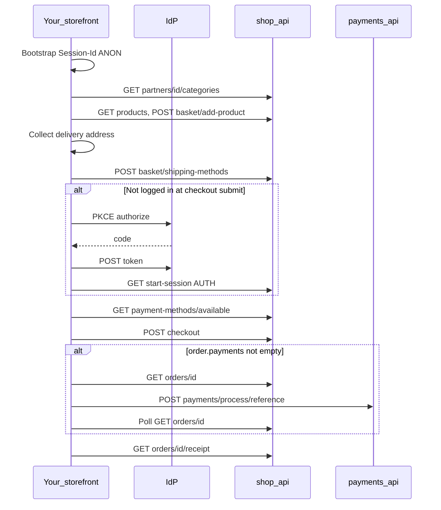
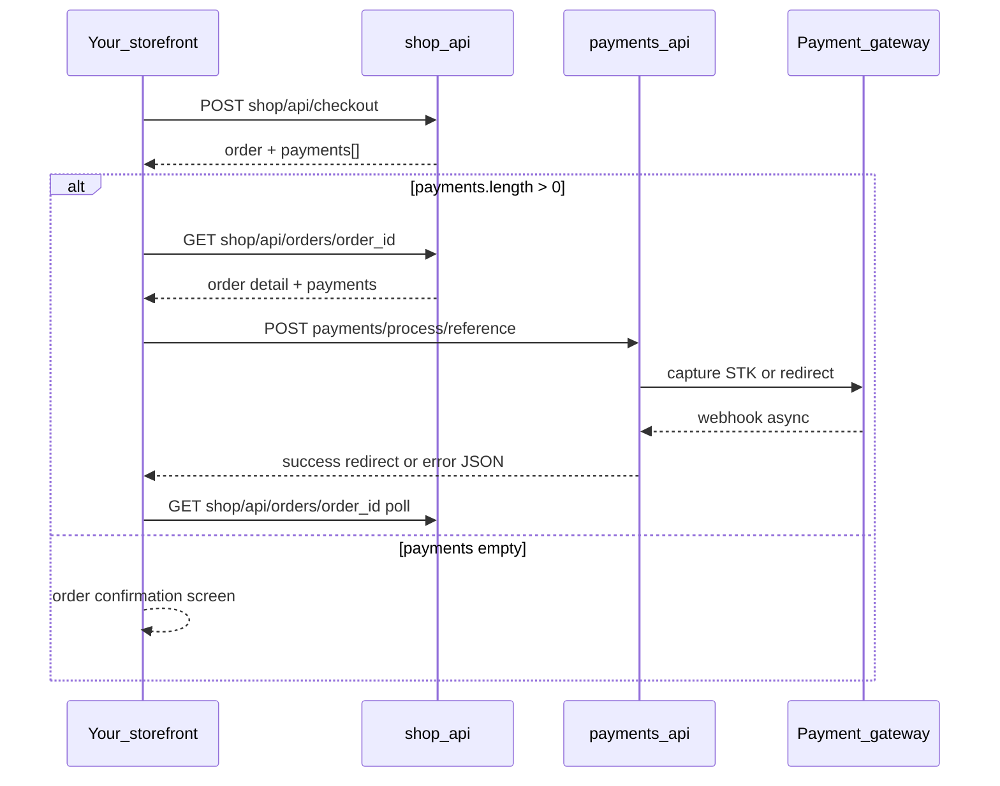
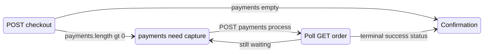
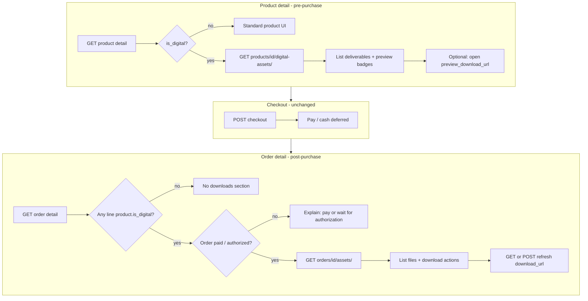
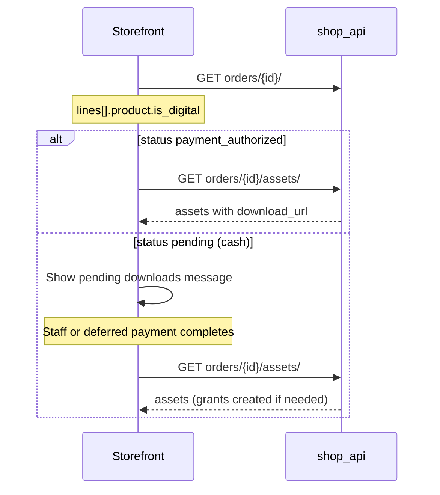

<!-- synced from fikashop-api/docs/storefront-integration.md @ 493cf847c119dbba76c4955c6cbf5c68b92e3ba4 — run scripts/sync-integration-doc.sh to refresh -->

# Fikashop API — Third-Party Storefront Integration Guide

This guide is for developers building **custom storefront websites** (web or mobile) that integrate with the Fikashop commerce API. It follows one customer journey end to end: browse a partner store, configure products, check out, pay, and view orders.

**Scoped integration:** You do **not** register or onboard partners through this API. FikaChu provisions the store and gives you a `{PARTNER_ID}` (and optionally a partner `code`). Send `X-Partner-Id: {PARTNER_ID}` on every shop request (see [§1 Setup](#1-setup)).

---

## How to use this guide

Read sections **in order** the first time. Use [Appendix A](#appendix-a-catalog-query-parameters), [Appendix D](#appendix-d-reference-implementation-map), [Appendix E](#appendix-e-production-considerations), and [§12](#12-error-reference) as lookups while building.

**Example store:** All samples use **Demo Kitchen** (`{PARTNER_ID}` = `1`, host `api.fikachu.com`) unless noted otherwise.

### Three API roots


| Root                   | Example                             | Used for                                                                |
| ---------------------- | ----------------------------------- | ----------------------------------------------------------------------- |
| `{OIDC_ISS}`           | `https://oidc.fikachu.com`          | Authorize, token, refresh, userinfo only                                |
| `{API_BASE}/shop/api/` | `https://api.fikachu.com/shop/api/` | Catalog, basket, checkout, orders                                       |
| `{API_BASE}/payments/` | `https://api.fikachu.com/payments/` | `POST …/process/{reference}/` after checkout — **not** under `shop/api` |


### Reference client and other docs


| Resource             | Location                                                                                                              |
| -------------------- | --------------------------------------------------------------------------------------------------------------------- |
| OpenAPI (schemas)    | `{API_BASE}/docs/`                                                                                                    |
| Postman collection   | `[Postman collection](https://github.com/fikachu/fikashop/blob/main/fikashop-api/postman/Fikashop.postman_collection.json)`                             |
| Standalone invoicing | `[invoice API integration guide](https://github.com/fikachu/fikashop/blob/main/fikashop-api/docs/README-invoice-api-integration.md)` (only if you sell invoice-backed products) |


**Mobile vs this guide:** The reference app `[fikashop-mobile](https://github.com/fikachu/fikashop/tree/main/fikashop-mobile)` may send a product `url` on add-to-cart; the API accepts `id` or `url` (same product). Options may use option `url` in the client; the API accepts option **code**, numeric **id**, or URL segment. See [Appendix D](#appendix-d-reference-implementation-map) for a file-by-file map.

### Customer lifecycle (single-partner storefront)

Build your UI around this flow. The **Storefront screen** column mirrors routes in the reference mobile app; your web app can use equivalent pages.


| Phase      | Storefront screen (mobile)  | API calls                                                                          | Mobile reference                                                                                                                                         |
| ---------- | --------------------------- | ---------------------------------------------------------------------------------- | -------------------------------------------------------------------------------------------------------------------------------------------------------- |
| Bootstrap  | Splash                      | Persist `Session-Id`; optional `GET /auth/api/user/` after login                   | [`auth.tsx`](https://github.com/fikachu/fikashop/tree/main/fikashop-mobile/src/stateStore/auth.tsx), [`index.tsx`](https://github.com/fikachu/fikashop/tree/main/fikashop-mobile/src/stateStore/index.tsx) |
| Store home | Partner menu                | `GET /partners/{PARTNER_ID}/categories/`                                           | [`[partner_id]/index.tsx`](https://github.com/fikachu/fikashop/tree/main/fikashop-mobile/app/(partners)/[partner_id]/index.tsx) |
| Product    | Product detail              | `GET /products/{id}/`                                                              | [`ProductDetailFullModal.tsx`](https://github.com/fikachu/fikashop/tree/main/fikashop-mobile/src/components/product/ProductDetailFullModal.tsx) |
| Cart       | `/cart`                     | `GET /basket/`, `PATCH`/`DELETE` lines                                             | [`cart.tsx`](https://github.com/fikachu/fikashop/tree/main/fikashop-mobile/app/(checkout)/cart.tsx) |
| Address    | `/landing?next=checkout`    | Client geocode/cache; then `POST /basket/shipping-methods/`                        | [`landing.tsx`](https://github.com/fikachu/fikashop/tree/main/fikashop-mobile/app/landing.tsx), [`CartCheckoutBottom.tsx`](https://github.com/fikachu/fikashop/tree/main/fikashop-mobile/src/components/checkout/CartCheckoutBottom.tsx) |
| Checkout   | `/checkout`                 | `GET …/payment-methods/available/`, `POST …/shipping-methods/`, `POST …/checkout/` | [`checkout/index.tsx`](https://github.com/fikachu/fikashop/tree/main/fikashop-mobile/app/(checkout)/checkout/index.tsx) |
| Pay        | `/checkout/payment-details` | `GET /orders/{id}/`, `POST /payments/process/{reference}/`                         | [`payment-details.tsx`](https://github.com/fikachu/fikashop/tree/main/fikashop-mobile/app/(checkout)/checkout/payment-details.tsx) |
| Done       | `/order-placed/{id}`        | `GET /orders/{id}/`, optional `GET …/receipt/`                                     | [`order-placed/[order_id].tsx`](https://github.com/fikachu/fikashop/tree/main/fikashop-mobile/app/(checkout)/order-placed/[order_id].tsx) |





### UI gates and preconditions

Enforce these before allowing checkout (reference app behavior):


| Gate                | Source                                                | Action                                                                                           |
| ------------------- | ----------------------------------------------------- | ------------------------------------------------------------------------------------------------ |
| Store open          | `partner.is_open`, `opening_hours`                    | Disable “order now”; show hours                                                                  |
| Minimum order       | `partner.min_order_amount` vs `basket.total_incl_tax` | Block checkout below minimum                                                                     |
| Delivery address    | Local address + ISO-2 `country`                       | Redirect to address picker if missing                                                            |
| Shipping quote      | Lat/lng on address                                    | Call `POST /basket/shipping-methods/` only when coordinates exist                                |
| Login               | Reference app policy                                  | Redirect to OIDC before `POST /checkout/` (API may allow guest checkout — see [§9](#9-checkout)) |
| Single-partner cart | `basket.partner.id`                                   | Must match `{PARTNER_ID}`; clear cart before switching stores                                    |


**Marketplace variant (optional):** `[fikashop-mobile](https://github.com/fikachu/fikashop/tree/main/fikashop-mobile)` also lists stores via `GET /partners/` and lets users switch partners. For a **single branded storefront**, hard-code `{PARTNER_ID}` and skip partner discovery.

---

## Table of contents

1. [How to use this guide](#how-to-use-this-guide)
2. [Setup](#1-setup)
3. [Client bootstrap and environment](#15-client-bootstrap-and-environment)
4. [Authentication](#2-authentication)
5. [Partner store homepage](#3-partner-store-homepage)
6. [Browsing the menu](#4-browsing-the-menu)
7. [Add to cart: options and modifier groups](#5-add-to-cart-options-and-modifier-groups)
8. [Cart management](#6-cart-management)
9. [Shipping address and methods](#7-shipping-address-and-methods)
10. [Payment methods](#8-payment-methods)
11. [Checkout](#9-checkout)
12. [Complete payment](#10-complete-payment)
13. [Order management](#11-order-management)
14. [Error reference](#12-error-reference)
15. [Quick-start checklist](#13-quick-start-checklist)

- [Appendix A: Catalog query parameters](#appendix-a-catalog-query-parameters)
- [Appendix B: Out of scope](#appendix-b-out-of-scope)
- [Appendix C: Digital assets — frontend integration](#appendix-c-digital-assets--frontend-integration)
- [Appendix D: Reference implementation map](#appendix-d-reference-implementation-map)
- [Appendix E: Production considerations](#appendix-e-production-considerations)

---

## Conventions


| Placeholder      | Meaning                                           |
| ---------------- | ------------------------------------------------- |
| `{API_BASE}`     | Fikashop API host, e.g. `https://api.fikachu.com` |
| `{OIDC_ISS}`     | Identity provider, `https://oidc.fikachu.com`     |
| `{ACCESS_TOKEN}` | OAuth2 access token from the IdP                  |
| `{SESSION_ID}`   | Basket session header value (see below)           |
| `{PARTNER_ID}`   | Partner primary key (integer) or partner `code` (e.g. `demo-kitchen`) |
| `{BASKET_ID}`    | Basket id from API responses                      |


**Headers on Fikashop API calls**


| Header                                 | When                                                                                                           |
| -------------------------------------- | -------------------------------------------------------------------------------------------------------------- |
| `X-Partner-Id: {PARTNER_ID}`           | **Required** on every `{API_BASE}/shop/api/…` request (catalog, basket, checkout, orders)                      |
| `Authorization: Bearer {ACCESS_TOKEN}` | Required for authenticated endpoints; optional for public catalog if your deployment allows anonymous browsing |
| `Session-Id: {SESSION_ID}`             | **Required** on all shop calls that use a basket or checkout (guest or authenticated). Without it, cart state will not persist across requests. |
| `Content-Type: application/json`       | POST/PATCH bodies                                                                                              |
| `Accept: application/json`             | All requests                                                                                                   |


**Session-Id format**

```
SID:{ANON|AUTH}:{api_hostname}:{uuid}
```

- `api_hostname` — hostname from `{API_BASE}` **without port** (e.g. `api.fikachu.com`).
- Use `ANON` before login, `AUTH` after login.
- Generate a new UUID v4 for each browser/device session.

Example: `SID:ANON:api.fikachu.com:550e8400-e29b-41d4-a716-446655440000`

---

## 1. Setup

### Base URL

Storefront commerce lives under:

```
{API_BASE}/shop/api/
```

Post-checkout payment capture lives at `{API_BASE}/payments/` (see [§10](#10-complete-payment)).

Examples:

- Basket: `GET {API_BASE}/shop/api/basket/`
- Checkout: `POST {API_BASE}/shop/api/checkout/`
- Capture payment: `POST {API_BASE}/payments/process/{reference}/`

### Pagination

Many list endpoints (products, categories, orders, etc.) return a paginated envelope:

```http
GET /shop/api/products/?page=1&size=15 HTTP/1.1
Host: api.fikachu.com
X-Partner-Id: {PARTNER_ID}
Accept: application/json
```

```json
HTTP/1.1 200 OK
{
  "page": 1,
  "is_paginated": true,
  "next": "https://api.fikachu.com/shop/api/products/?page=2&size=15",
  "previous": null,
  "count": 42,
  "total_pages": 3,
  "results": [
    {
      "id": 42,
      "title": "Classic Burger",
      "slug": "classic-burger",
      "stockrecords": [{ "price": "12000.00", "price_currency": "TZS" }]
    }
  ]
}
```

Query parameters: `page` (default `1`), `size` (default `15`, max `10000` on shop list endpoints using the project pagination class).

### Store scope: `X-Partner-Id` header

FikaChu assigns you a single store id (`{PARTNER_ID}`). Send it on **every** shop API call so products, prices, basket, payment methods, and checkout stay scoped to that store.

```http
X-Partner-Id: 1
```

(Replace with your real `{PARTNER_ID}`.)

**Configure once in your HTTP client** (same pattern as `[fikashop-mobile](https://github.com/fikachu/fikashop/tree/main/fikashop-mobile)` `setSelectedPartner`):

```javascript
// Example: global fetch wrapper
const PARTNER_ID = process.env.FIKASHOP_PARTNER_ID; // e.g. "42"

async function shopApi(path, options = {}) {
  const headers = new Headers(options.headers);
  headers.set("X-Partner-Id", PARTNER_ID);
  headers.set("Accept", "application/json");
  if (options.body && !headers.has("Content-Type")) {
    headers.set("Content-Type", "application/json");
  }
  return fetch(`${API_BASE}/shop/api${path}`, { ...options, headers });
}

// Usage
const products = await shopApi("/products/?page=1");
const checkout = await shopApi("/checkout/", {
  method: "POST",
  body: JSON.stringify(checkoutBody),
});
```

```javascript
// Example: apisauce (same library as fikashop-mobile)
import { create } from "apisauce";

const shopApi = create({
  baseURL: `${API_BASE}/shop/api/`,
  headers: {
    Accept: "application/json",
    "Content-Type": "application/json",
  },
});

shopApi.setHeader("X-Partner-Id", process.env.FIKASHOP_PARTNER_ID);

// After login — also set per request or via setHeader:
// shopApi.setHeader("Authorization", `Bearer ${accessToken}`);
// shopApi.setHeader("Session-Id", sessionId);

const { data, ok, problem } = await shopApi.get("/products/", { page: 1 });
if (!ok) throw new Error(problem || "Request failed");

const checkout = await shopApi.post("/checkout/", checkoutBody);
```

```bash
# Example: curl — repeat on every request
export PARTNER_ID=1
curl -sS "${API_BASE}/shop/api/basket/" \
  -H "X-Partner-Id: ${PARTNER_ID}" \
  -H "Session-Id: ${SESSION_ID}"
```

Also set `Authorization` and `Session-Id` on the same requests when applicable (see [Conventions](#conventions) and the [authentication matrix](#23-authentication-matrix)).

Partner profile URLs use `{PARTNER_ID}` in the **path** (not as a query parameter):


| Endpoint                                 | Purpose                              |
| ---------------------------------------- | ------------------------------------ |
| `GET /partners/{PARTNER_ID}/`            | Partner profile only                 |
| `GET /partners/{PARTNER_ID}/categories/` | Partner profile + menu category tree |


## 1.5 Client bootstrap and environment

Mirror the reference app's HTTP client setup (`[config.ts](https://github.com/fikachu/fikashop/tree/main/fikashop-mobile/src/utils/config.ts)`, `[api.ts](https://github.com/fikachu/fikashop/tree/main/fikashop-mobile/src/utils/api.ts)`).

### Environment variables


| Variable                                        | Example                       | Purpose                                                   |
| ----------------------------------------------- | ----------------------------- | --------------------------------------------------------- |
| `API_BASE` / `EXPO_PUBLIC_API_BASE_URL`         | `https://api.fikachu.com`     | Shop + payments host                                      |
| `OIDC_ISS` / `EXPO_PUBLIC_OIDC_ISSUER`          | `https://oidc.fikachu.com`    | Authorize, token, userinfo                                |
| `OIDC_CLIENT_ID` / `EXPO_PUBLIC_OIDC_CLIENT_ID` | `your-client-id`              | OAuth2 public client                                      |
| `OIDC_REDIRECT_URI`                             | `https://your-store.com/auth` | Must match IdP registration                               |
| `PARTNER_ID` / `FIKASHOP_PARTNER_ID`            | `1`                           | Sent as `X-Partner-Id` on every shop call                 |
| `DEFAULT_COUNTRY_CODE`                          | `TZ`                          | Fallback ISO-2 for addresses when geocoding omits country |


### Session persistence

1. **First visit** — generate UUID v4; set `Session-Id: SID:ANON:{api_hostname}:{uuid}`; persist in `localStorage` / `AsyncStorage` (mobile key: shop session id).
2. **Return visit** — reload persisted `Session-Id` if still valid for the same API hostname.
3. **After login** — keep the **same UUID**; change only `ANON` → `AUTH`; call `GET /shop/api/start-session/` to merge the guest basket.
4. **Logout** — clear Bearer tokens; delete persisted session; generate a **new** anon `Session-Id`.

```javascript
const SESSION_STORAGE_KEY = "fikashop_session_id";

function loadOrCreateSessionId(apiBase, authType = "ANON") {
  const hostname = new URL(apiBase).hostname;
  const stored = localStorage.getItem(SESSION_STORAGE_KEY);
  if (stored && stored.includes(`:${hostname}:`)) {
    // Preserve UUID on login — flip ANON → AUTH in place
    if (authType === "AUTH" && stored.startsWith("SID:ANON:")) {
      return stored.replace("SID:ANON:", "SID:AUTH:");
    }
    return stored;
  }
  const uuid = crypto.randomUUID();
  const sessionId = `SID:${authType}:${hostname}:${uuid}`;
  localStorage.setItem(SESSION_STORAGE_KEY, sessionId);
  return sessionId;
}
```

### Partner scoping: header and optional query

Send `X-Partner-Id: {PARTNER_ID}` on **every** `/shop/api/` request. The reference app also appends `?partner={PARTNER_ID}` on basket, add-product, checkout, and payment-methods calls. Server resolution order (`[partner_scope.py](https://github.com/fikachu/fikashop/blob/main/fikashop-api/shop/utils/partner_scope.py)`): `?partner=` → `X-Partner-Id` → session `partner_id`.

For a fixed single-store site, the header alone is sufficient; include `?partner=` when mirroring mobile or debugging partner resolution.

### Token refresh on 401

Register an HTTP interceptor (mobile: `configureAuthRefresh` in `[api.ts](https://github.com/fikachu/fikashop/tree/main/fikashop-mobile/src/utils/api.ts)`):

1. On `401`, exchange `refresh_token` at `{OIDC_ISS}/token/` (`grant_type=refresh_token`).
2. Retry the failed request with the new `access_token`.
3. On refresh failure, clear auth and send the user to login.

If `start-session` or basket calls return a **realm** mismatch error, clear session and re-login (mobile logs out automatically).

### Bootstrap sequence (app start)

```javascript
// 1. Create client with base URL and X-Partner-Id
// 2. Load or create Session-Id (ANON)
// 3. If stored access_token exists, set Authorization + AUTH Session-Id
// 4. If logged in: GET /auth/api/user/ and/or GET /shop/api/start-session/
// 5. Load cached delivery address from local storage (optional)
```

Reference: [`startSession`](https://github.com/fikachu/fikashop/tree/main/fikashop-mobile/src/stateStore/index.tsx) in the mobile root store.

## 2. Authentication

Fikashop is an **OAuth2 resource server**. It validates `Authorization: Bearer` tokens via introspection at `{OIDC_ISS}/introspect/`. User sign-up, phone verification, and passwordless login happen on the **FikaChu IdP** (`https://oidc.fikachu.com`).

### 2.1 OpenID discovery

**Request**

```http
GET /.well-known/openid-configuration HTTP/1.1
Host: oidc.fikachu.com
```

**Response** (excerpt)

```json
HTTP/1.1 200 OK
{
  "issuer": "https://oidc.fikachu.com",
  "authorization_endpoint": "https://oidc.fikachu.com/authorize/",
  "token_endpoint": "https://oidc.fikachu.com/token/",
  "userinfo_endpoint": "https://oidc.fikachu.com/userinfo/",
  "introspection_endpoint": "https://oidc.fikachu.com/introspect/"
}
```

### 2.2 Authorize (browser redirect)

Send the user to the authorization endpoint with **Authorization Code + PKCE** (`S256`).

**Example authorize URL** (query parameters illustrated):

```
https://oidc.fikachu.com/authorize/
  ?client_id=YOUR_CLIENT_ID
  &redirect_uri=https%3A%2F%2Fyour-store.com%2Fauth
  &response_type=code
  &scope=openid+profile+email+phone+offline_access
  &state=RANDOM_STATE
  &code_challenge=BASE64URL_SHA256_VERIFIER
  &code_challenge_method=S256
  &login_with=phone
  &auth_flow=passwordless
```

Onboarding (phone entry, OTP) is rendered by the IdP, not your storefront calling Fikashop.

### 2.3 Authentication matrix

Use this table when wiring headers. “Bearer required” means a valid `Authorization: Bearer {ACCESS_TOKEN}` unless your deployment allows anonymous access for that route.


| Endpoint group                                  | `Session-Id` | Bearer       | Notes                                                                                                |
| ----------------------------------------------- | ------------ | ------------ | ---------------------------------------------------------------------------------------------------- |
| Catalog, basket (browse, add, update)           | **Required** | Optional     | Anonymous browsing and cart OK                                                                       |
| `GET /shop/api/start-session/`                  | `AUTH`       | **Required** | Merges anonymous basket into user                                                                    |
| `GET /auth/api/user/`                           | Recommended  | **Required** | Profile for account UI (mobile uses this)                                                            |
| Saved addresses, order list/detail              | `AUTH`       | **Required** | Object permissions on orders                                                                         |
| `POST /shop/api/checkout/`                      | **Required** | Optional*    | *Guest checkout when `OSCAR_ALLOW_ANON_CHECKOUT` is enabled (see [§9](#9-checkout))                  |
| `POST {API_BASE}/payments/process/{reference}/` | Optional     | Often sent   | Endpoint allows unauthenticated POST; send Bearer and `X-Partner-Id` if your client already has them |


### 2.4 Session lifecycle

1. **On first visit** — generate UUID v4; set `Session-Id: SID:ANON:{api_hostname}:{uuid}` on all shop calls; persist locally.
2. **After OIDC login** — keep the **same UUID**. The reference app calls `GET /shop/api/start-session/` with Bearer while the header may still show `ANON`, then flips to `SID:AUTH:…` in `initLoginData` ([`auth.tsx`](https://github.com/fikachu/fikashop/tree/main/fikashop-mobile/src/stateStore/auth.tsx)). Either order works if the UUID is unchanged.
3. **Call** `GET /shop/api/start-session/` with Bearer + the same session header so the anonymous basket merges into the user basket.
4. **Do not** rotate the UUID on login (you would lose the guest basket). Rotate only when the user clears site data or you start a new device session.

Optional profile refresh: `GET {API_BASE}/auth/api/user/` with Bearer (and `Session-Id` if your client sends it). `start-session` returns `{ user, basket_id }` in one call after login.

### 2.5 Exchange authorization code for tokens

**Request**

```http
POST /token/ HTTP/1.1
Host: oidc.fikachu.com
Content-Type: application/x-www-form-urlencoded

grant_type=authorization_code
&code=AUTH_CODE_FROM_CALLBACK
&redirect_uri=https%3A%2F%2Fyour-store.com%2Fauth
&client_id=YOUR_CLIENT_ID
&code_verifier=PKCE_VERIFIER_PLAINTEXT
```

**Response**

```json
HTTP/1.1 200 OK
{
  "access_token": "eyJhbGciOiJSUzI1NiIsInR5cCI6IkpXVCJ9...",
  "token_type": "Bearer",
  "expires_in": 3600,
  "refresh_token": "def50200...",
  "scope": "openid profile email phone offline_access"
}
```

**curl**

```bash
curl -sS -X POST "https://oidc.fikachu.com/token/" \
  -H "Content-Type: application/x-www-form-urlencoded" \
  --data-urlencode "grant_type=authorization_code" \
  --data-urlencode "code=AUTH_CODE_FROM_CALLBACK" \
  --data-urlencode "redirect_uri=https://your-store.com/auth" \
  --data-urlencode "client_id=YOUR_CLIENT_ID" \
  --data-urlencode "code_verifier=PKCE_VERIFIER_PLAINTEXT"
```

**JavaScript**

```javascript
const body = new URLSearchParams({
  grant_type: "authorization_code",
  code: authCode,
  redirect_uri: "https://your-store.com/auth",
  client_id: process.env.OIDC_CLIENT_ID,
  code_verifier: pkceVerifier,
});

const tokenRes = await fetch("https://oidc.fikachu.com/token/", {
  method: "POST",
  headers: { "Content-Type": "application/x-www-form-urlencoded" },
  body,
});
const tokens = await tokenRes.json();
const accessToken = tokens.access_token;
```

### 2.6 Refresh access token

When `expires_in` is near expiry, exchange the refresh token (requires `offline_access` in authorize scope).

**Request**

```http
POST /token/ HTTP/1.1
Host: oidc.fikachu.com
Content-Type: application/x-www-form-urlencoded

grant_type=refresh_token
&refresh_token=def50200...
&client_id=YOUR_CLIENT_ID
```

**Response** — same shape as §2.5 (`access_token`, optional rotated `refresh_token`, `expires_in`).

### 2.7 Userinfo (optional)

**Request**

```http
GET /userinfo/ HTTP/1.1
Host: oidc.fikachu.com
Authorization: Bearer {ACCESS_TOKEN}
```

**Response**

```json
HTTP/1.1 200 OK
{
  "sub": "oidc-sub-abc123",
  "email": "customer@example.com",
  "given_name": "Asha",
  "family_name": "Mwangi",
  "phone_number": "+255712345678"
}
```

### 2.8 Start Fikashop session (merge basket)

After login, switch `Session-Id` to `AUTH` and call start-session so anonymous basket lines merge into the user account.

**Request**

```http
GET /shop/api/start-session/ HTTP/1.1
Host: api.fikachu.com
X-Partner-Id: {PARTNER_ID}
Authorization: Bearer {ACCESS_TOKEN}
Session-Id: SID:AUTH:api.fikachu.com:550e8400-e29b-41d4-a716-446655440000
Accept: application/json
```

**Response**

```json
HTTP/1.1 200 OK
{
  "user": {
    "id": 42,
    "username": "oidc-sub-abc123",
    "email": "customer@example.com",
    "first_name": "Asha",
    "last_name": "Mwangi",
    "phone": "+255712345678",
    "is_phone_verified": true
  },
  "basket_id": 17
}
```

**curl**

```bash
export API_BASE="https://api.fikachu.com"
export ACCESS_TOKEN="eyJhbGciOi..."
export SESSION_ID="SID:AUTH:api.fikachu.com:550e8400-e29b-41d4-a716-446655440000"

curl -sS "${API_BASE}/shop/api/start-session/" \
  -H "X-Partner-Id: ${PARTNER_ID}" \
  -H "Authorization: Bearer ${ACCESS_TOKEN}" \
  -H "Session-Id: ${SESSION_ID}"
```

**JavaScript**

```javascript
const res = await fetch(`${API_BASE}/shop/api/start-session/`, {
  headers: {
    "X-Partner-Id": PARTNER_ID,
    Authorization: `Bearer ${accessToken}`,
    "Session-Id": sessionId,
    Accept: "application/json",
  },
});
const { user, basket_id } = await res.json();
```

If the user is not authenticated:

```json
HTTP/1.1 405 Method Not Allowed
{
  "detail": "Not logged in"
}
```

### 2.9 Login gate at checkout (reference app)

The API may allow guest checkout when `OSCAR_ALLOW_ANON_CHECKOUT` is enabled ([§9](#9-checkout)). The **reference mobile app always requires login** before `POST /checkout/` because order history, receipts, and saved addresses need a Bearer token.

**Flow when the user is not authenticated at checkout submit:**

1. User completes the checkout form (shipping method, payment method, contact fields).
2. On submit, redirect to OIDC authorize (do **not** call `POST /checkout/` yet).
3. Preserve form state in the return URL query string, e.g. `/checkout?is_preview=true&full_name=Asha+Mwangi&phone_number=%2B255712345678&notes=Gate+B`.
4. After authorization code exchange, call `GET /shop/api/start-session/` with Bearer (same `Session-Id` UUID; mobile then sets `SID:AUTH:…`).
5. Navigate back to `/checkout?is_preview=true&…` with fields prefilled.
6. On authenticated submit, call `POST /shop/api/checkout/`.

Reference: [`onSubmitLogin`](https://github.com/fikachu/fikashop/tree/main/fikashop-mobile/app/(checkout)/checkout/index.tsx) and [`onLogin`](https://github.com/fikachu/fikashop/tree/main/fikashop-mobile/src/stateStore/auth.tsx).

**Recommendation:** Require login at checkout even if your deployment allows guests — it simplifies order tracking and payment retries.

---

## 3. Partner store homepage

Use the `{PARTNER_ID}` supplied when your store was set up on FikaChu. There is no separate “partner integration” or onboarding API for third-party storefronts.

Reference: [`[partner_id]/index.tsx`](https://github.com/fikachu/fikashop/tree/main/fikashop-mobile/app/(partners)/[partner_id]/index.tsx).

### 3.1 Storefront rules (partner fields)

Use partner profile fields to drive UX before checkout:


| Field                | Use in your storefront                                            |
| -------------------- | ----------------------------------------------------------------- |
| `is_open`            | Disable “order now” when false; show `opening_hours` when present |
| `min_order_amount`   | Compare to basket `total_incl_tax`; block checkout below minimum  |
| `allow_shipping`     | Expect delivery methods only when true                            |
| `allow_store_pickup` | Pickup / `pick-up` shipping codes when true                       |
| `allow_dine_in`      | Dine-in shipping method when configured                           |


Some deployments quote shipping using coordinates on the address (`location` on `shipping_address` in order responses). Pass the same address shape to `POST /shop/api/basket/shipping-methods/`; geo-specific delivery integrations are deployment-dependent.

### 3.2 Store homepage + menu categories (primary)

Single call for the store landing page: partner profile + category tree (only categories that have stock for this partner).

**Request**

```http
GET /shop/api/partners/{PARTNER_ID}/categories/ HTTP/1.1
Host: api.fikachu.com
X-Partner-Id: {PARTNER_ID}
Session-Id: SID:ANON:api.fikachu.com:550e8400-e29b-41d4-a716-446655440000
Accept: application/json
```

**Response**

```json
HTTP/1.1 200 OK
{
    "id": 1,
    "wallet_id": "809a3e2f-5c3e-4896-8d14-d3d1ff73fa7d",
    "url": "https://api.fikachu.com/shop/api/partners/1/",
    "code": "demo-kitchen",
    "name": "Demo Kitchen",
    "email": "info@email.com",
    "phone_number": "+255123....",
    "bio": "This is a good place",
    "description": "Choma (BBQ) | Makange | Grilled & Fried Chicken | Seafood | Sides (Rice, Chips & Plantains - Ndizi)",
    "logo": null,
    "cover_photo": "https://api.fikachu.com/media/cover.png",
    "min_order_amount": 1.0,
    "is_active": true,
    "is_featured": false,
    "is_open": false,
    "allow_shipping": true,
    "allow_store_pickup": true,
    "allow_dine_in": false,
    "allow_flexible_delivery": true,
  "categories": [
    {
      "id": 10,
      "name": "Mains",
      "slug": "mains",
      "breadcrumbs": "mains",
      "children": [
        {
          "id": 11,
          "name": "Burgers",
          "slug": "burgers",
          "breadcrumbs": "mains/burgers",
          "children": []
        }
      ]
    },
    {
      "id": 20,
      "name": "Drinks",
      "slug": "drinks",
      "breadcrumbs": "drinks",
      "children": []
    }
  ],
    "opening_hours": [
        {
            "id": 15,
            "weekday": 1,
            "is_open": true,
            "weekday_name": "Monday",
            "start": "11:00:00",
            "end": "23:30:59",
            "partner": 1
        },
        {
            "id": 16,
            "weekday": 2,
            "is_open": true,
            "weekday_name": "Tuesday",
            "start": "11:00:00",
            "end": "23:30:59",
            "partner": 1
        },
        {
            "id": 17,
            "weekday": 3,
            "is_open": true,
            "weekday_name": "Wednesday",
            "start": "11:00:00",
            "end": "23:30:59",
            "partner": 1
        },
        {
            "id": 18,
            "weekday": 4,
            "is_open": true,
            "weekday_name": "Thursday",
            "start": "11:00:00",
            "end": "23:30:59",
            "partner": 1
        },
        {
            "id": 19,
            "weekday": 5,
            "is_open": true,
            "weekday_name": "Friday",
            "start": "11:00:00",
            "end": "23:30:59",
            "partner": 1
        },
        {
            "id": 20,
            "weekday": 6,
            "is_open": true,
            "weekday_name": "Saturday",
            "start": "11:00:00",
            "end": "23:30:59",
            "partner": 1
        },
        {
            "id": 21,
            "weekday": 7,
            "is_open": true,
            "weekday_name": "Sunday",
            "start": "11:00:00",
            "end": "23:30:59",
            "partner": 1
        }
    ],
    "primary_address": {
        "id": 2,
        "first_name": "",
        "last_name": "",
        "phone_number": "",
        "line1": "Bay Bistro",
        "line2": "",
        "state": "Dar es Salaam",
        "postcode": "",
        "country": "TZ",
        "formatted_address": "Bay Bistro, Dar es Salaam, TZ",
        "location": {
            "type": "Point",
            "coordinates": [
                39.271232877673825,
                -6.77731500547664
            ]
        },
        "url": "https://api.fikachu.com/shop/api/admin/partner-addresses/2/",
        "is_default": true
    }
}
```

### 3.3 Partner detail only (optional)

If you only need store metadata (no category tree in the same response):

```http
GET /shop/api/partners/{PARTNER_ID}/ HTTP/1.1
Host: api.fikachu.com
X-Partner-Id: {PARTNER_ID}
Accept: application/json
```

```json
HTTP/1.1 200 OK
{
    "id": 1,
    "wallet_id": "809a3e2f-5c3e-4896-8d14-d3d1ff73fa7d",
    "url": "https://api.fikachu.com/shop/api/partners/1/",
    "code": "demo-kitchen",
    "name": "Demo Kitchen",
    "email": "",
    "phone_number": "",
    "bio": "",
    "description": "Choma (BBQ) | Makange | Grilled & Fried Chicken | Seafood | Sides (Rice, Chips & Plantains - Ndizi)",
    "logo": null,
    "cover_photo": null,
    "min_order_amount": 1.0,
    "is_active": true,
    "is_featured": false,
    "is_open": false,
    "social_links": [],
    "allow_shipping": true,
    "allow_store_pickup": true,
    "allow_dine_in": false,
    "allow_flexible_delivery": true,
    "opening_hours": [
        {
            "id": 15,
            "weekday": 1,
            "is_open": true,
            "weekday_name": "Monday",
            "start": "11:00:00",
            "end": "23:30:59",
            "partner": 1
        },
        {
            "id": 16,
            "weekday": 2,
            "is_open": true,
            "weekday_name": "Tuesday",
            "start": "11:00:00",
            "end": "23:30:59",
            "partner": 1
        },
        {
            "id": 17,
            "weekday": 3,
            "is_open": true,
            "weekday_name": "Wednesday",
            "start": "11:00:00",
            "end": "23:30:59",
            "partner": 1
        },
        {
            "id": 18,
            "weekday": 4,
            "is_open": true,
            "weekday_name": "Thursday",
            "start": "11:00:00",
            "end": "23:30:59",
            "partner": 1
        },
        {
            "id": 19,
            "weekday": 5,
            "is_open": true,
            "weekday_name": "Friday",
            "start": "11:00:00",
            "end": "23:30:59",
            "partner": 1
        },
        {
            "id": 20,
            "weekday": 6,
            "is_open": true,
            "weekday_name": "Saturday",
            "start": "11:00:00",
            "end": "23:30:59",
            "partner": 1
        },
        {
            "id": 21,
            "weekday": 7,
            "is_open": true,
            "weekday_name": "Sunday",
            "start": "11:00:00",
            "end": "23:30:59",
            "partner": 1
        }
    ],
    "primary_address": {
        "id": 2,
        "first_name": "",
        "last_name": "",
        "phone_number": "",
        "line1": "Bay Bistro",
        "line2": "",
        "state": "Dar es Salaam",
        "postcode": "",
        "country": "TZ",
        "formatted_address": "Bay Bistro, Dar es Salaam, TZ",
        "location": {
            "type": "Point",
            "coordinates": [
                39.271232877673825,
                -6.77731500547664
            ]
        },
        "url": "https://api.fikachu.com/shop/api/admin/partner-addresses/2/",
        "is_default": true
    }
}
```

---

## 4. Browsing the menu

Include `X-Partner-Id: {PARTNER_ID}` on every catalog request.

### 4.1 Categories

**Request**

```http
GET /shop/api/categories/ HTTP/1.1
Host: api.fikachu.com
X-Partner-Id: {PARTNER_ID}
Accept: application/json
```

**Response**

```json
HTTP/1.1 200 OK
{
  "page": 1,
  "count": 2,
  "total_pages": 1,
  "results": [
    {
      "id": 10,
      "name": "Mains",
      "slug": "mains",
      "breadcrumbs": "mains",
      "children": [
        {
          "id": 11,
          "name": "Burgers",
          "slug": "burgers",
          "breadcrumbs": "mains/burgers",
          "children": []
        }
      ]
    }
  ]
}
```

Nested paths: `GET /shop/api/categories/mains/burgers/` (with `X-Partner-Id` header)

### 4.2 Product list

**Request**

```http
GET /shop/api/products/?structure=standalone&is_public=true&partner=1&search=burger HTTP/1.1
Host: api.fikachu.com
X-Partner-Id: 1
Accept: application/json
```

The reference app sends `is_public=true` and `partner={PARTNER_ID}` on menu product lists ([`fetchProducts`](https://github.com/fikachu/fikashop/tree/main/fikashop-mobile/src/stateStore/index.tsx)). `X-Partner-Id` alone is usually sufficient for a single-store site; include `partner` when mirroring mobile.

**Response**

```json
HTTP/1.1 200 OK
{
  "page": 1,
  "count": 1,
  "total_pages": 1,
  "results": [
    {
      "id": 42,
      "url": "https://api.fikachu.com/shop/api/products/42/",
      "title": "Classic Burger",
      "slug": "classic-burger",
      "upc": "BURGER-001",
      "description": "Beef patty, lettuce, tomato",
      "is_public": true,
      "product_class": "food",
      "categories": ["Mains > Burgers"],
      "images": [
        {
          "id": 5,
          "original": "https://api.fikachu.com/media/products/burger.jpg",
          "caption": ""
        }
      ],
      "stockrecords": [
        {
          "id": 101,
          "price": "12000.00",
          "price_currency": "TZS",
          "num_in_stock": 50,
          "partner": 1
        }
      ]
    }
  ]
}
```

### 4.3 Product detail

**Request**

```http
GET /shop/api/products/classic-burger/ HTTP/1.1
Host: api.fikachu.com
X-Partner-Id: {PARTNER_ID}
Session-Id: SID:ANON:api.fikachu.com:550e8400-e29b-41d4-a716-446655440000
Accept: application/json
```

Lookup by numeric `id`, `slug`, or `upc`.

**Response** (excerpt — includes modifier groups on stockrecords)

```json
HTTP/1.1 200 OK
{
  "id": 42,
  "title": "Classic Burger",
  "slug": "classic-burger",
  "description": "Beef patty, lettuce, tomato",
  "options": [
    {
      "id": 1,
      "url": "https://api.fikachu.com/shop/api/options/special-instructions/",
      "code": "special-instructions",
      "name": "Special instructions",
      "type": "text",
      "required": false
    }
  ],
  "stockrecords": [
    {
      "id": 101,
      "price": "12000.00",
      "price_currency": "TZS",
      "num_in_stock": 50,
      "partner": 1,
      "modifier_groups": [
        {
          "id": 3,
          "code": "extras",
          "name": "Extras",
          "help_text": "Choose add-ons",
          "min_permitted": 0,
          "max_permitted": 3,
          "modifier_options": [
            {
              "id": 18081,
              "title": "Extra cheese",
              "price": "1500.00",
              "price_currency": "TZS",
              "min_quantity": 0,
              "max_quantity": 2,
              "default_quantity": 0,
              "stockrecord_id": 205
            },
            {
              "id": 18082,
              "title": "Bacon",
              "price": "2000.00",
              "price_currency": "TZS",
              "min_quantity": 0,
              "max_quantity": 1,
              "default_quantity": 0,
              "stockrecord_id": 206
            }
          ]
        },
        {
          "id": 4,
          "code": "cooking",
          "name": "Cooking preference",
          "min_permitted": 1,
          "max_permitted": 1,
          "modifier_options": [
            {
              "id": 18144,
              "title": "Medium",
              "price": "0.00",
              "min_quantity": 1,
              "max_quantity": 1,
              "default_quantity": 1
            }
          ]
        }
      ]
    }
  ]
}
```

---

## 5. Add to cart: options and modifier groups

`POST /shop/api/basket/add-product/` accepts a product reference, optional **product options** (configured text fields), and optional **modifier groups** (priced add-ons on the stockrecord).

### When to use which


| Mechanism         | On product detail                             | Purpose                                                                            |
| ----------------- | --------------------------------------------- | ---------------------------------------------------------------------------------- |
| `options`         | Top-level `options[]` (Oscar product options) | Free-text or configured fields (e.g. engraving, special instructions, domain name) |
| `modifier_groups` | Under each `stockrecords[]` entry             | Priced add-ons (extras, sides, cooking preference with surcharge)                  |


### Canonical payload

```json
{
  "id": 42,
  "quantity": 1,
  "options": [
    { "option": "special-instructions", "value": "No onions" }
  ],
  "modifier_groups": {
    "3": [{ "id": 18081, "quantity": 1 }],
    "4": [{ "id": 18144, "quantity": 1 }]
  }
}
```


| Field             | Rules                                                                                                                                                      |
| ----------------- | ---------------------------------------------------------------------------------------------------------------------------------------------------------- |
| `id` or `url`     | **One required**; must reference the same product. `id` may be numeric id, slug, or UPC. `url` may be a full product-detail URL (reference mobile client). |
| `options`         | Optional. Each item: `option` = option **code**, numeric **id**, or option-detail URL segment; `value` = string stored on the line.                        |
| `modifier_groups` | Optional. Keys = modifier group **id**; values = arrays of `{ "id": <modifier_option_product_id>, "quantity": n }`.                                        |


Modifier UI fields (on `stockrecords[].modifier_groups`):


| Field                                              | Use                                                               |
| -------------------------------------------------- | ----------------------------------------------------------------- |
| `min_permitted` / `max_permitted`                  | How many distinct options the customer must/can pick in the group |
| `modifier_options[].min_quantity` / `max_quantity` | Per-option quantity limits                                        |
| `modifier_options[].price`                         | Extra charge (may be `0.00`)                                      |


---

## 6. Cart management

Reference: `[index.tsx](https://github.com/fikachu/fikashop/tree/main/fikashop-mobile/src/stateStore/index.tsx)` (`addToBasket`, `fetchBasket`, `updateBasketLine`, `removeFromBasket`).

### 6.1 Get current basket

**Request**

```http
GET /shop/api/basket/ HTTP/1.1
Host: api.fikachu.com
X-Partner-Id: {PARTNER_ID}
Session-Id: SID:ANON:api.fikachu.com:550e8400-e29b-41d4-a716-446655440000
Accept: application/json
```

**Response** (empty)

```json
HTTP/1.1 200 OK
{
  "id": 17,
  "owner": null,
  "status": "Open",
  "lines": [],
  "url": "https://api.fikachu.com/shop/api/baskets/17/",
  "total_excl_tax": "0.00",
  "total_incl_tax": "0.00",
  "total_incl_tax_excl_discounts": "0.00",
  "total_excl_tax_excl_discounts": "0.00",
  "currency": "TZS",
  "voucher_discounts": [],
  "offer_discounts": []
}
```

Optional query parameters (reference app passes these on every basket refresh so totals include shipping and payment surcharges):

```http
GET /shop/api/basket/?partner=1&payment_method_code=mpesa&shipping_method_code=standard HTTP/1.1
Host: api.fikachu.com
X-Partner-Id: 1
Session-Id: SID:ANON:api.fikachu.com:550e8400-e29b-41d4-a716-446655440000
Accept: application/json
```

Reference: `[fetchBasket](https://github.com/fikachu/fikashop/tree/main/fikashop-mobile/src/stateStore/index.tsx)`. The mobile client caches basket GETs for ~20 seconds unless `{ force: true }` after a mutation.

### 6.2 Add product

See [§5](#5-add-to-cart-options-and-modifier-groups) for field rules. Example with both options and modifiers:

**Request**

```http
POST /shop/api/basket/add-product/ HTTP/1.1
Host: api.fikachu.com
X-Partner-Id: {PARTNER_ID}
Session-Id: SID:ANON:api.fikachu.com:550e8400-e29b-41d4-a716-446655440000
Content-Type: application/json

{
  "id": 42,
  "quantity": 1,
  "options": [
    { "option": "special-instructions", "value": "No onions" }
  ],
  "modifier_groups": {
    "3": [{ "id": 18081, "quantity": 1 }],
    "4": [{ "id": 18144, "quantity": 1 }]
  }
}
```

**Response**

```json
HTTP/1.1 200 OK
{
  "id": 17,
  "status": "Open",
  "lines": [
    {
      "url": "https://api.fikachu.com/shop/api/baskets/17/lines/88/",
      "product": {
        "id": 42,
        "title": "Classic Burger"
      },
      "quantity": 1,
      "price_currency": "TZS",
      "price_excl_tax": "13500.00",
      "price_incl_tax": "13500.00",
      "stockrecord": {
        "id": 101,
        "price": "12000.00"
      }
    }
  ],
  "total_incl_tax": "13500.00",
  "currency": "TZS"
}
```

**curl**

```bash
curl -sS -X POST "${API_BASE}/shop/api/basket/add-product/" \
  -H "X-Partner-Id: ${PARTNER_ID}" \
  -H "Content-Type: application/json" \
  -H "Session-Id: ${SESSION_ID}" \
  -d '{
    "id": 42,
    "quantity": 1,
    "options": [{ "option": "special-instructions", "value": "No onions" }],
    "modifier_groups": {
      "3": [{ "id": 18081, "quantity": 1 }],
      "4": [{ "id": 18144, "quantity": 1 }]
    }
  }'
```

**Failure** (out of stock or validation)

Validation errors return `406` with either a string or object in `reason` (see [§12](#12-error-reference)).

```json
HTTP/1.1 406 Not Acceptable
{
  "reason": "a maximum of 50 can be bought"
}
```

### 6.3 Update line quantity

**Request**

```http
PATCH /shop/api/baskets/17/lines/88/ HTTP/1.1
Host: api.fikachu.com
X-Partner-Id: {PARTNER_ID}
Session-Id: SID:ANON:api.fikachu.com:550e8400-e29b-41d4-a716-446655440000
Content-Type: application/json

{
  "quantity": 2
}
```

**Response** — full basket object (same shape as `GET /shop/api/basket/`).

### 6.4 Remove line

**Request**

```http
DELETE /shop/api/baskets/17/lines/88/ HTTP/1.1
Host: api.fikachu.com
X-Partner-Id: {PARTNER_ID}
Session-Id: SID:ANON:api.fikachu.com:550e8400-e29b-41d4-a716-446655440000
```

**Response**

```http
HTTP/1.1 204 No Content
```

### 6.5 Add voucher

**Request**

```http
POST /shop/api/basket/add-voucher/ HTTP/1.1
Host: api.fikachu.com
X-Partner-Id: {PARTNER_ID}
Session-Id: SID:ANON:api.fikachu.com:550e8400-e29b-41d4-a716-446655440000
Content-Type: application/json

{
  "vouchercode": "WELCOME10"
}
```

**Response** — updated basket JSON (200).

### 6.6 Add product (mobile / URL style)

The reference app sends the product hypermedia URL instead of numeric `id`:

```http
POST /shop/api/basket/add-product/?partner=1 HTTP/1.1
Host: api.fikachu.com
X-Partner-Id: 1
Session-Id: SID:ANON:api.fikachu.com:550e8400-e29b-41d4-a716-446655440000
Content-Type: application/json

{
  "url": "https://api.fikachu.com/shop/api/products/42/",
  "quantity": 1,
  "options": [{ "option": "special-instructions", "value": "No onions" }],
  "modifier_groups": {
    "3": [{ "id": 18081, "quantity": 1 }]
  }
}
```

Reference: `[addToBasket](https://github.com/fikachu/fikashop/tree/main/fikashop-mobile/src/stateStore/index.tsx)`.

### 6.7 Single-partner cart constraint

A basket is scoped to one partner (`basket.partner.id`). If the customer adds a product from a different `{PARTNER_ID}`, block the action and offer to clear the cart first. The reference app shows a confirmation dialog before clearing.

When updating or deleting lines, append `?partner={PARTNER_ID}` to the line URL (mobile: `urlAddPartnerId`).

---

## 7. Shipping address & methods

Authenticated users can save addresses. Country on addresses and checkout uses **ISO 3166-1 alpha-2** (e.g. `TZ`), not a URL.

### 7.1 List saved addresses

**Request**

```http
GET /shop/api/user-addresses/ HTTP/1.1
Host: api.fikachu.com
X-Partner-Id: {PARTNER_ID}
Authorization: Bearer {ACCESS_TOKEN}
Session-Id: SID:AUTH:api.fikachu.com:550e8400-e29b-41d4-a716-446655440000
Accept: application/json
```

**Response**

```json
HTTP/1.1 200 OK
{
  "page": 1,
  "count": 1,
  "results": [
    {
      "id": 5,
      "first_name": "Asha",
      "last_name": "Mwangi",
      "line1": "Plot 12, Oysterbay",
      "line2": "",
      "line3": "",
      "line4": "Dar es Salaam",
      "state": "Dar es Salaam",
      "postcode": "14111",
      "country": "TZ",
      "phone_number": "+255712345678",
      "notes": "Gate B",
      "is_default_for_shipping": true
    }
  ]
}
```

### 7.2 Create address

**Request**

```http
POST /shop/api/user-addresses/ HTTP/1.1
Host: api.fikachu.com
X-Partner-Id: {PARTNER_ID}
Authorization: Bearer {ACCESS_TOKEN}
Content-Type: application/json

{
  "first_name": "Asha",
  "last_name": "Mwangi",
  "line1": "Plot 12, Oysterbay",
  "line4": "Dar es Salaam",
  "state": "Dar es Salaam",
  "postcode": "14111",
  "country": "TZ",
  "phone_number": "+255712345678",
  "notes": "Gate B"
}
```

**Response**

```json
HTTP/1.1 201 Created
{
  "id": 6,
  "first_name": "Asha",
  "last_name": "Mwangi",
  "line1": "Plot 12, Oysterbay",
  "country": "TZ",
  "phone_number": "+255712345678"
}
```

### 7.3 Shipping methods for basket

The reference mobile app uses **POST** with a draft shipping address (same shape as checkout) so quotes reflect location.

**Request**

```http
POST /shop/api/basket/shipping-methods/ HTTP/1.1
Host: api.fikachu.com
X-Partner-Id: {PARTNER_ID}
Session-Id: SID:ANON:api.fikachu.com:550e8400-e29b-41d4-a716-446655440000
Content-Type: application/json

{
  "country": "TZ",
  "line1": "Plot 12, Oysterbay",
  "line4": "Dar es Salaam",
  "state": "Dar es Salaam",
  "postcode": "14111",
  "phone_number": "+255712345678",
  "location": {
    "type": "Point",
    "coordinates": [39.2712, -6.7773]
  }
}
```

Include `location` with `[longitude, latitude]` for geo-based delivery quotes ([§7.5](#75-full-shipping_address-at-checkout)). Omit `location` only when pickup/digital flows do not need distance-based pricing.

**Response** (shape depends on partner configuration)

```json
HTTP/1.1 200 OK
[
  {
    "code": "standard",
    "name": "Standard delivery",
    "description": "Delivered within 45 minutes",
    "price": {
      "currency": "TZS",
      "excl_tax": "2000.00",
      "incl_tax": "2000.00"
    },
    "is_discounted": false
  },
  {
    "code": "pick-up",
    "name": "Store pickup",
    "description": "Collect at counter",
    "price": {
      "currency": "TZS",
      "excl_tax": "0.00",
      "incl_tax": "0.00"
    },
    "is_discounted": false
  }
]
```

Use the chosen method’s `code` as `shipping_method_code` at checkout.

### 7.4 Delivery location collection (reference app)

Saved addresses ([§7.1](#71-list-saved-addresses)) are optional. The reference app collects delivery location on a dedicated address screen before checkout:

1. User searches or uses GPS to pick a point on the map.
2. Reverse-geocode to `line1`, `line4`, `postcode`, and ISO-2 `country`.
3. Cache the result locally (mobile: `shippingAddress` on the root store).
4. Cart and checkout link to the address picker when coordinates are missing (`/landing?next=checkout`).

Only call `POST /basket/shipping-methods/` when latitude and longitude are available.

### 7.5 Full `shipping_address` at checkout

Include a GeoJSON `Point` for delivery quotes and driver routing. Coordinates are `**[longitude, latitude]**` (not lat/lng).

```json
{
  "country": "TZ",
  "first_name": "Asha",
  "last_name": "Mwangi",
  "line1": "Plot 12, Oysterbay",
  "line2": "",
  "line3": "",
  "line4": "Dar es Salaam",
  "postcode": "14111",
  "phone_number": "+255712345678",
  "location": {
    "type": "Point",
    "coordinates": [39.2712, -6.7773]
  },
  "notes": "Gate B"
}
```

Reference: `[formatShippingAddress](https://github.com/fikachu/fikashop/tree/main/fikashop-mobile/src/stateStore/index.tsx)`.

### 7.6 `user_address` at checkout

When the customer selects a saved address, pass its id so the API links the order to the address book entry. **`shipping_address` is optional** in that case — the API copies fields from the saved row when inline `shipping_address` is omitted.

**Minimal payload** (saved address already has country, lines, phone, `location`, etc.):

```json
{
  "basket": 17,
  "user_address": 5,
  "shipping_method_code": "standard",
  "payment": { "...": "..." }
}
```

**With checkout-time overrides** — send both; the saved row is the base and inline fields overlay it (e.g. updated `notes` or refreshed `location`):

```json
{
  "user_address": 5,
  "shipping_address": {
    "notes": "Gate B",
    "location": { "type": "Point", "coordinates": [39.2712, -6.7773] }
  }
}
```

The reference mobile app always sends `shipping_address` from the checkout form and adds `user_address` when the user picks from `/addresses` ([`checkout/index.tsx`](https://github.com/fikachu/fikashop/tree/main/fikashop-mobile/app/(checkout)/checkout/index.tsx)).

### 7.7 Shipping method defaults and delivery notes

- Use `shipping_method_code: "no-shipping-required"` for pickup-only or digital-only baskets when no delivery method applies.
- For delivery methods, collect driver instructions in `shipping_address.notes` (reference app requires notes unless the method is pickup / `no-shipping-required`).

---

## 8. Payment methods

Partner-specific methods for the current basket (falls back to public **cash** when none configured).

**Request**

```http
GET /shop/api/checkout/payment-methods/available/ HTTP/1.1
Host: api.fikachu.com
X-Partner-Id: {PARTNER_ID}
Authorization: Bearer {ACCESS_TOKEN}
Session-Id: SID:AUTH:api.fikachu.com:550e8400-e29b-41d4-a716-446655440000
Accept: application/json
```

**Response**

```json
HTTP/1.1 200 OK
[
  {
    "code": "cash",
    "name": "Cash on delivery",
    "method_type": "cash",
    "description": "Pay when your order arrives",
    "image_url": null,
    "input_fields": []
  },
  {
    "code": "mpesa",
    "name": "M-Pesa",
    "method_type": "online-payments",
    "description": "Pay with Vodacom M-Pesa",
    "image_url": "https://api.fikachu.com/media/source_types/images/mpesa.png",
    "input_fields": [
      {
        "code": "msisdn",
        "label": "M-Pesa number",
        "type": "string",
        "is_required": true,
        "help_text": "255XXXXXXXXX",
        "default_value": null,
        "schema": {}
      }
    ]
  },
  {
    "code": "wallet",
    "name": "FikaChu Wallet",
    "method_type": "wallet",
    "description": "Pay from your wallet balance",
    "image_url": null,
    "input_fields": []
  }
]
```

**Provider codes** (`code` field) your deployment may expose: `cash`, `mpesa`, `selcom`, `safaricom`, `tigo_pesa`, `airtel_money`, `tips`, `snippe_mobile`, `snippe_card`, `clickpesa_mobile`, `clickpesa_card`, `wallet`.

Each method also has a `method_type` used as the **key** in the checkout `payment` object (see [§9](#9-checkout)) — typically `cash`, `online-payments`, or `wallet`. The gateway-specific `code` (e.g. `mpesa`) is sent as `variant` inside that block.

The reference app requests methods with an explicit partner query when needed:

```http
GET /shop/api/checkout/payment-methods/available/?partner=1 HTTP/1.1
```

### 8.1 Rendering `input_fields`

Build checkout and payment forms dynamically from each method's `input_fields[]`:


| Field         | Use                                                                                         |
| ------------- | ------------------------------------------------------------------------------------------- |
| `code`        | Form field name; key in `payment…input_fields` at checkout and in `POST /payments/process/` |
| `type`        | `string`, `password`, `boolean`, `checkbox`, etc.                                           |
| `is_required` | Client-side validation before submit                                                        |
| `schema`      | Optional `choices` / `options` / `enum` for select lists                                    |


**Prefill** common billing fields from the logged-in user and shipping address:


| `input_fields.code`                        | Typical source                               |
| ------------------------------------------ | -------------------------------------------- |
| `billing_phone`                            | User phone / `shipping_address.phone_number` |
| `billing_email`                            | User email                                   |
| `billing_first_name` / `billing_last_name` | User profile                                 |
| `msisdn`                                   | Mobile money number (method-specific)        |


Reference: `[paymentInputValidation.ts](https://github.com/fikachu/fikashop/tree/main/fikashop-mobile/src/utils/paymentInputValidation.ts)`, `[PaymentInputField.tsx](https://github.com/fikachu/fikashop/tree/main/fikashop-mobile/src/components/checkout/PaymentInputField.tsx)`.

At checkout submit, copy `phone_number` into `billing_phone` when the payment method expects it (mobile merges shipping phone into payment inputs).

---

## 9. Checkout

Endpoint:

```
POST {API_BASE}/shop/api/checkout/
```

Send `X-Partner-Id: {PARTNER_ID}` on this request (and on [§8](#8-payment-methods) `payment-methods/available/` beforehand) so payment methods resolve for your store.

Required concepts:

- `basket` — open basket **id** (integer) or URL, e.g. `17` or `https://api.fikachu.com/shop/api/baskets/17/`
- `shipping_address` — inline object (ISO-2 `country`, e.g. `"TZ"`); **omit when `user_address` is set** and the saved row is complete ([§7.6](#76-user_address-at-checkout))
- `user_address` — optional saved address id; when set without `shipping_address`, the API fills shipping from the address book
- `shipping_method_code` — from [§7.3](#73-shipping-methods-for-basket); use `no-shipping-required` when appropriate
- `payment` — one enabled method; use `method_type` as the object key, `variant` = payment method `code`, `input_fields` from [§8](#8-payment-methods)

`pay_balance` defaults to `true` when omitted.

Prefer `basket.id` from `GET /shop/api/basket/` or `basket_id` from `GET /shop/api/start-session/` — you do not need to build a hypermedia URL for checkout.

Country in addresses: **ISO-2** string (`"TZ"`), not `/shop/api/countries/.../` URLs.

### Checkout screen load sequence (reference app)

When the checkout page gains focus and a delivery address with coordinates exists:

1. `GET /shop/api/checkout/payment-methods/available/?partner={PARTNER_ID}`
2. `POST /shop/api/basket/shipping-methods/` with the formatted `shipping_address` ([§7.5](#75-full-shipping_address-at-checkout))
3. User selects `shipping_method_code` and `payment_method` → refresh basket with `payment_method_code` and `shipping_method_code` query params ([§6.1](#61-get-current-basket))
4. On submit: `POST /shop/api/checkout/?partner={PARTNER_ID}`

Reference: [`checkout/index.tsx`](https://github.com/fikachu/fikashop/tree/main/fikashop-mobile/app/(checkout)/checkout/index.tsx) `useEffect` on focus.

### Complete checkout request (reference payload)

Authenticated delivery order with location, saved address link, and M-Pesa. The reference app sends **both** `user_address` and inline `shipping_address` so checkout-time edits can override the saved row; see [§7.6](#76-user_address-at-checkout) for the slimmer `user_address`-only shape.

```http
POST /shop/api/checkout/ HTTP/1.1
Host: api.fikachu.com
X-Partner-Id: 1
Authorization: Bearer {ACCESS_TOKEN}
Session-Id: SID:AUTH:api.fikachu.com:550e8400-e29b-41d4-a716-446655440000
Content-Type: application/json

{
  "basket": "https://api.fikachu.com/shop/api/baskets/17/",
  "user_address": 5,
  "shipping_method_code": "standard",
  "shipping_address": {
    "country": "TZ",
    "first_name": "Asha",
    "last_name": "Mwangi",
    "line1": "Plot 12, Oysterbay",
    "line2": "",
    "line3": "",
    "line4": "Dar es Salaam",
    "postcode": "14111",
    "phone_number": "+255712345678",
    "location": {
      "type": "Point",
      "coordinates": [39.2712, -6.7773]
    },
    "notes": "Gate B"
  },
  "payment": {
    "online-payments": {
      "enabled": true,
      "variant": "mpesa",
      "input_fields": {
        "msisdn": "255712345678",
        "billing_phone": "255712345678"
      }
    }
  }
}
```

**Routing after success** (reference app):

- `order.payments.length > 0` → payment screen (`/checkout/payment-details?order_id={id}`)
- else → confirmation (`/order-placed/{id}`)

### Checkout error parsing

On `406` or failed checkout, surface errors in this order (reference app):

1. `errors.basket` — array of strings
2. `errors.non_field_errors` — array of strings
3. Other field keys — flatten object values to strings
4. HTTP client `problem` / status text

Reference: [`onSubmitCheckout`](https://github.com/fikachu/fikashop/tree/main/fikashop-mobile/app/(checkout)/checkout/index.tsx).

### Checkout idempotency and double-submit

Shop checkout does **not** accept an `Idempotency-Key` header (unlike some subscription endpoints). In production:

- Disable the place-order button while `POST /checkout/` is in flight.
- Do not auto-retry checkout on network timeout without checking whether an order was created (`GET /shop/api/orders/` or store the returned order id on success).
- A duplicate submit with the same open basket may update or conflict depending on basket state — treat checkout as **at-most-once** from the client.

### Guest checkout

When your deployment has `OSCAR_ALLOW_ANON_CHECKOUT` enabled, users may checkout with only `Session-Id: SID:ANON:…` (no Bearer). Oscar may require `guest_email` for anonymous users; if omitted and `CHECKOUT_ALLOW_EMPTY_GUEST_EMAIL` is true, the API may use an internal placeholder for validation and store a blank email on the order.

**Request** (guest, cash)

```http
POST /shop/api/checkout/ HTTP/1.1
Host: api.fikachu.com
X-Partner-Id: 1
Session-Id: SID:ANON:api.fikachu.com:550e8400-e29b-41d4-a716-446655440000
Content-Type: application/json

{
  "basket": "https://api.fikachu.com/shop/api/baskets/17/",
  "guest_email": "guest@example.com",
  "shipping_method_code": "pick-up",
  "shipping_address": {
    "first_name": "Guest",
    "last_name": "User",
    "line1": "Counter pickup",
    "country": "TZ",
    "phone_number": "+255712345678",
    "location": {
      "type": "Point",
      "coordinates": [39.2712, -6.7773]
    }
  },
  "payment": {
    "cash": {
      "enabled": true,
      "variant": "cash",
      "input_fields": {}
    }
  }
}
```

Order history and saved addresses still require login ([authentication matrix](#23-authentication-matrix)).

Some deployments enable `API_CHECKOUT_CAPTCHA` on checkout — when active, include `recaptcha` in the checkout body ([Appendix E](#appendix-e-production-considerations)).

### Payment object shape

```json
"payment": {
  "{method_type}": {
    "enabled": true,
    "variant": "{code}",
    "input_fields": {
      "billing_phone": "255712345678"
    }
  }
}
```

Example: M-Pesa has `code: "mpesa"`, `method_type: "online-payments"` → key `online-payments`, `variant: "mpesa"`.

### 9.1 Cash on delivery

**Request**

```http
POST /shop/api/checkout/ HTTP/1.1
Host: api.fikachu.com
X-Partner-Id: {PARTNER_ID}
Authorization: Bearer {ACCESS_TOKEN}
Session-Id: SID:AUTH:api.fikachu.com:550e8400-e29b-41d4-a716-446655440000
Content-Type: application/json

{
  "basket": "https://api.fikachu.com/shop/api/baskets/17/",
  "shipping_method_code": "standard",
  "shipping_address": {
    "first_name": "Asha",
    "last_name": "Mwangi",
    "line1": "Plot 12, Oysterbay",
    "line4": "Dar es Salaam",
    "state": "Dar es Salaam",
    "postcode": "14111",
    "country": "TZ",
    "phone_number": "+255712345678",
    "notes": "Gate B",
    "location": {
      "type": "Point",
      "coordinates": [39.2712, -6.7773]
    }
  },
  "payment": {
    "cash": {
      "enabled": true,
      "variant": "cash",
      "input_fields": {}
    }
  }
}
```

**Response**

```json
HTTP/1.1 200 OK
{
  "id": 901,
  "number": "100000901",
  "status": "Pending",
  "currency": "TZS",
  "total_incl_tax": "15500.00",
  "total_excl_tax": "15500.00",
  "shipping_incl_tax": "2000.00",
  "shipping_method": "Standard delivery",
  "shipping_code": "standard",
  "email": "customer@example.com",
  "guest_email": "",
  "shipping_address": {
    "first_name": "Asha",
    "last_name": "Mwangi",
    "line1": "Plot 12, Oysterbay",
    "country": "TZ",
    "phone_number": "+255712345678",
    "location": {
      "type": "Point",
      "coordinates": [39.2712, -6.7773]
    }
  },
  "lines": [
    {
      "id": 1201,
      "quantity": 1,
      "title": "Classic Burger",
      "price_incl_tax": "13500.00",
      "product": {
        "id": 42,
        "title": "Classic Burger",
        "image_url": "https://api.fikachu.com/media/products/burger.jpg"
      },
      "partner_id": 1,
      "partner_name": "Demo Kitchen",
      "modifier_groups": [
        {
          "id": 3,
          "name": "Extras",
          "modifier_options": [
            {
              "id": 1202,
              "quantity": 1,
              "product": { "id": 18081, "title": "Extra cheese" },
              "price_incl_tax": "1500.00"
            }
          ]
        }
      ]
    }
  ],
  "payments": [
    {
      "id": 55,
      "variant": "cash",
      "variant_name": "Cash",
      "status": "waiting",
      "total": "15500.00",
      "captured_amount": "0.00",
      "reference": "gw-token-abc123",
      "message": ""
    }
  ]
}
```

**Next step (mobile):** if `payments.length > 0`, show a payment screen and complete via [§10](#10-complete-payment). If `payments` is empty, go straight to order confirmation.

### 9.2 Mobile money (M-Pesa)

From [§8](#8-payment-methods), read `method_type` (`online-payments`) and `code` (`mpesa`).

**Request**

```http
POST /shop/api/checkout/ HTTP/1.1
Host: api.fikachu.com
X-Partner-Id: {PARTNER_ID}
Authorization: Bearer {ACCESS_TOKEN}
Session-Id: SID:AUTH:api.fikachu.com:550e8400-e29b-41d4-a716-446655440000
Content-Type: application/json

{
  "basket": "https://api.fikachu.com/shop/api/baskets/17/",
  "shipping_method_code": "standard",
  "shipping_address": {
    "first_name": "Asha",
    "last_name": "Mwangi",
    "line1": "Plot 12, Oysterbay",
    "line4": "Dar es Salaam",
    "country": "TZ",
    "phone_number": "+255712345678",
    "location": {
      "type": "Point",
      "coordinates": [39.2712, -6.7773]
    }
  },
  "payment": {
    "online-payments": {
      "enabled": true,
      "variant": "mpesa",
      "input_fields": {
        "msisdn": "255712345678"
      }
    }
  }
}
```

**Response** — order created with a pending gateway payment:

```json
HTTP/1.1 200 OK
{
  "id": 902,
  "number": "100000902",
  "status": "Pending",
  "total_incl_tax": "15500.00",
  "payments": [
    {
      "id": 56,
      "variant": "mpesa",
      "variant_name": "M-Pesa",
      "status": "waiting",
      "total": "15500.00",
      "reference": "gw-token-def456",
      "extra_data": {}
    }
  ]
}
```

Continue with `POST /payments/process/{reference}/` in [§10](#10-complete-payment) 

### 9.3 Wallet (authenticated)

**Request**

```http
POST /shop/api/checkout/ HTTP/1.1
Host: api.fikachu.com
X-Partner-Id: {PARTNER_ID}
Authorization: Bearer {ACCESS_TOKEN}
Content-Type: application/json

{
  "basket": "https://api.fikachu.com/shop/api/baskets/17/",
  "shipping_method_code": "pick-up",
  "shipping_address": {
    "first_name": "Asha",
    "last_name": "Mwangi",
    "line1": "Plot 12, Oysterbay",
    "country": "TZ",
    "phone_number": "+255712345678",
    "location": {
      "type": "Point",
      "coordinates": [39.2712, -6.7773]
    }
  },
  "payment": {
    "wallet": {
      "enabled": true,
      "variant": "wallet",
      "input_fields": {}
    }
  }
}
```

**Response** — same order shape; `payments[].status` may become `confirmed` after [§10](#10-complete-payment) when balance suffices.

### 9.4 Validation error example

```json
HTTP/1.1 406 Not Acceptable
{
  "non_field_errors": [
    "'Classic Burger' is no longer available to buy (Unavailable). Please adjust your basket to continue."
  ]
}
```

---

## 10. Complete payment

After `POST {API_BASE}/shop/api/checkout/`, some orders include `payments[]` rows that still need capture (M-Pesa STK, card redirect, etc.). Capture uses `{API_BASE}/payments/`, not `shop/api`.

**Capture URL:** `POST {API_BASE}/payments/process/{reference}/` where `reference` = `order.payments[].reference`.

`[fikashop-mobile](https://github.com/fikachu/fikashop/tree/main/fikashop-mobile)` completes this in two steps after checkout:




### 10.1 When to show the payment screen

After checkout (`§9`), inspect `order.payments`:


| Condition               | Action                                                                                    |
| ----------------------- | ----------------------------------------------------------------------------------------- |
| `payments.length > 0` with actionable `status` | Navigate to payment UI (mobile: `/checkout/payment-details?order_id=…`) |
| `payments.length === 0` | Skip to order confirmation (typical for **cash on delivery** and other deferred methods) |


Treat payment rows with **actionable** statuses as needing completion: `waiting`, `pending`, `preauth`, `error`, `failed`.

**Success** statuses (stop polling; show confirmation): `confirmed`, `success`, `settled`, `paid`.

**Cash on delivery:** Deferred cash often returns **`payments: []`** at checkout — go straight to order confirmation. The order stays `Pending` until cash is collected server-side. Digital downloads stay locked until `payment_authorized` ([Appendix C](#c5-when-downloads-are-available)). Storefront clients **cannot** call `complete-deferred-payment` today (see [§10.7](#107-deferred-payment-staff-only)).

### 10.2 Load order for payment UI

**Request**

```http
GET /shop/api/orders/902/ HTTP/1.1
Host: api.fikachu.com
X-Partner-Id: {PARTNER_ID}
Authorization: Bearer {ACCESS_TOKEN}
Accept: application/json
```

**Response** (excerpt)

```json
HTTP/1.1 200 OK
{
  "id": 902,
  "number": "100000902",
  "status": "Pending",
  "total_incl_tax": "15500.00",
  "shipping_address": {
    "first_name": "Asha", "last_name":"Anderson",
    "line1": "Plot 12, Oysterbay",
    "line4": "Dar es Salaam",
    "country": "TZ",
    "phone_number": "+255712345678",
    "location": {
      "type": "Point",
      "coordinates": [39.2712, -6.7773]
    }
  },
  "payments": [
    {
      "id": 56,
      "variant": "mpesa",
      "variant_name": "M-Pesa",
      "status": "waiting",
      "total": "15500.00",
      "reference": "gw-token-def456",
      "payment_method": {
        "code": "mpesa",
        "name": "M-Pesa",
        "input_fields": [
          { "code": "billing_phone", "label": "M-Pesa number", "type": "string", "is_required": true }
        ]
      },
      "extra_data": { "input_fields": {} }
    }
  ]
}
```

Build the payment form from `payment_method.input_fields`. Prefill billing fields from `shipping_address` and the logged-in user (mobile prefills `billing_phone`, `billing_email`, address lines, etc.).

### 10.3 Capture / confirm payment

**Request**

```http
POST /payments/process/gw-token-def456/ HTTP/1.1
Host: api.fikachu.com
X-Partner-Id: {PARTNER_ID}
Authorization: Bearer {ACCESS_TOKEN}
Content-Type: application/json

{
  "action": "capture",
  "input_fields": {
    "billing_phone": "+255712345678",
    "billing_email": "customer@example.com"
  }
}
```

Use `payments[].reference` from the order (same value as the gateway token in the URL).

**Response** — success (inline / STK initiated)

```json
HTTP/1.1 200 OK
{
  "status": "success",
  "detail": "Payment submitted"
}
```

**Response** — redirect (card / hosted checkout)

```json
HTTP/1.1 200 OK
{
  "status": "redirect",
  "redirect_url": "https://gateway.example.com/pay/session/xyz",
  "detail": "Complete payment in the browser"
}
```

Open `redirect_url` in the browser or in-app browser, then return to your order-confirmation route.

**Response** — error (inline JSON body)

```json
HTTP/1.1 200 OK
{
  "status": "error",
  "code": "declined",
  "detail": "Payment was declined"
}
```

Some providers raise `PaymentError` with a non-200 HTTP status (commonly `400`). Handle both:

```json
HTTP/1.1 400 Bad Request
{
  "status": "error",
  "detail": "Payment was declined"
}
```

`X-Partner-Id` on `POST /payments/process/` is optional (endpoint is `AllowAny`); include it only if your client sends it on all API calls.

**Sample JavaScript** to implement the custom built payment details screen `/checkout/payment-details?order_id=…`

```javascript
const reference = order.payments[0].reference;
const res = await fetch(`${API_BASE}/payments/process/${reference}/`, {
  method: "POST",
  headers: {
    "X-Partner-Id": PARTNER_ID,
    Authorization: `Bearer ${accessToken}`,
    "Content-Type": "application/json",
  },
  body: JSON.stringify({
    action: "capture",
    input_fields: paymentInputs,
  }),
});
const data = await res.json();

if (data.status === "redirect" && data.redirect_url) {
  window.location.href = data.redirect_url;
} else {
  const refreshed = await fetch(`${API_BASE}/shop/api/orders/${order.id}/`, {
    headers: {
      "X-Partner-Id": PARTNER_ID,
      Authorization: `Bearer ${accessToken}`,
    },
  });
  // Navigate to order confirmation using refreshed order
}
```

### 10.4 After payment (polling)

1. Prefer `GET /shop/api/checkout/payment-states/{order_id}/` for lightweight status checks ([§10.6](#106-payment-states-polling)).
2. Or `GET /shop/api/orders/{order_id}/` for full order detail (see [§11.0](#110-order-and-payment-statuses)).
3. Show order confirmation when payment reaches a terminal success status.
4. From order history, link back to payment UI if status is still actionable.

**Polling:** For STK and async gateways, poll every **2–5 seconds** for up to **2–3 minutes**, then show “payment pending” with a retry path. The reference mobile app performs **one** order refresh after capture rather than a timed loop — use polling for production web flows where the user may close the tab before the gateway webhook lands. Gateways update orders server-side via webhooks; your storefront does not receive those webhooks directly.

### 10.5 Redirect and hosted checkout

When `POST /payments/process/{reference}/` returns `"status": "redirect"`:

```json
{
  "status": "redirect",
  "redirect_url": "https://gateway.example.com/pay/session/xyz",
  "detail": "Complete payment in the browser"
}
```

Open `redirect_url` in the system browser or an in-app webview, then return to your order-confirmation route. Mobile uses `Linking.openURL`; web uses `window.location.href`.

### 10.6 Payment states (polling)

Lighter alternative to full order detail when waiting for async capture:

**Request**

```http
GET /shop/api/checkout/payment-states/902/ HTTP/1.1
Host: api.fikachu.com
X-Partner-Id: {PARTNER_ID}
Authorization: Bearer {ACCESS_TOKEN}
Accept: application/json
```

**Response**

```json
HTTP/1.1 200 OK
{
  "order_status": "Pending",
  "payment_method_states": {
    "online-payments": {
      "status": "waiting",
      "amount": "15500.00",
      "required_action": "capture"
    }
  }
}
```

Requires order owner or staff permission. Returns `404` for unrelated users.

### 10.7 Deferred payment (staff-only — not for storefront clients)

`POST /shop/api/checkout/complete-deferred-payment/` settles deferred cash / pay-later balances after checkout. It is **not** used by [`fikashop-mobile`](https://github.com/fikachu/fikashop/tree/main/fikashop-mobile) and is **not callable from a standard storefront integration** today because:

- The `order` field must be a **server-signed order token**, not order `id`, `number`, or URL.
- Checkout and order JSON responses **do not include** this token (`OrderTokenField` in the API codebase).

**OpenAPI shape** (for staff tools and future API exposure):

```json
{
  "order": "<server-signed-order-token>",
  "payment": {
    "cash": {
      "enabled": true,
      "pay_balance": true
    }
  }
}
```

Until the API exposes an `order_token` (or equivalent) on checkout responses, treat cash collection and digital unlock after COD as **partner staff / admin** workflows. Storefront UX: show order confirmation and explain that downloads or fulfillment follow payment collection.

---

## 11. Order management

### 11.0 Order and payment statuses

**Order `status`** (common values; exact set may vary by deployment):


| Status                              | Typical meaning                  |
| ----------------------------------- | -------------------------------- |
| `Pending`                           | Placed; payment may still be due |
| `Authorized` / `payment_authorized` | Payment authorized or captured   |
| `Shipped`                           | Fulfilled / shipped              |
| `Canceled`                          | Cancelled                        |
| `Payment Declined`                  | Payment failed at order level    |


**Payment `payments[].status`** (for post-checkout capture):


| Status                                    | Storefront action                                            |
| ----------------------------------------- | ------------------------------------------------------------ |
| `waiting`, `pending`, `preauth`, `error`  | Show payment UI; call `POST …/payments/process/{reference}/` |
| `confirmed`, `success`, `settled`, `paid` | Show confirmation; stop polling                              |





### 11.1 List orders

**Request**

```http
GET /shop/api/orders/?page=1 HTTP/1.1
Host: api.fikachu.com
X-Partner-Id: {PARTNER_ID}
Authorization: Bearer {ACCESS_TOKEN}
Accept: application/json
```

**Response**

```json
HTTP/1.1 200 OK
{
  "page": 1,
  "count": 1,
  "results": [
    {
      "id": 901,
      "number": "100000901",
      "url": "https://api.fikachu.com/shop/api/orders/901/",
      "status": "Pending",
      "currency": "TZS",
      "total_incl_tax": "15500.00",
      "date_placed": "2026-05-16T12:00:00+03:00",
      "shipping_method": "Standard delivery",
      "lines": [
        {
          "id": 1201,
          "title": "Classic Burger",
          "quantity": 1,
          "price_incl_tax": "13500.00",
          "product": { "id": 42, "title": "Classic Burger" }
        }
      ],
      "payments": [
        {
          "variant": "mpesa",
          "status": "waiting",
          "total": "15500.00",
          "reference": "gw-token-abc123"
        }
      ]
    }
  ]
}
```

### 11.2 Order detail

**Request**

```http
GET /shop/api/orders/100000901/ HTTP/1.1
Host: api.fikachu.com
X-Partner-Id: {PARTNER_ID}
Authorization: Bearer {ACCESS_TOKEN}
Accept: application/json
```

Lookup by **order number** or numeric `id`.

**Response** (abbreviated; same order as [§9.1](#91-cash-on-delivery))

```json
HTTP/1.1 200 OK
{
  "id": 901,
  "number": "100000901",
  "status": "Pending",
  "currency": "TZS",
  "total_incl_tax": "15500.00",
  "shipping_method": "Standard delivery",
  "shipping_code": "standard",
  "shipping_address": {
    "first_name": "Asha",
    "last_name": "Mwangi",
    "line1": "Plot 12, Oysterbay",
    "country": "TZ",
    "phone_number": "+255712345678",
    "location": {
      "type": "Point",
      "coordinates": [39.2712, -6.7773]
    }
  },
  "lines": [
    {
      "id": 1201,
      "quantity": 1,
      "title": "Classic Burger",
      "price_incl_tax": "13500.00",
      "product": { "id": 42, "title": "Classic Burger", "is_digital": false },
      "modifier_groups": [
        {
          "name": "Extras",
          "modifier_options": [
            {
              "quantity": 1,
              "product": { "title": "Extra cheese" },
              "price_incl_tax": "1500.00"
            }
          ]
        }
      ]
    }
  ],
  "payments": [
    {
      "id": 55,
      "variant": "mpesa",
      "variant_name": "M-Pesa",
      "status": "waiting",
      "total": "15500.00",
      "reference": "gw-token-abc123"
    }
  ]
}
```

### 11.3 Order receipt URL

**Request**

```http
GET /shop/api/orders/100000901/receipt/ HTTP/1.1
Host: api.fikachu.com
X-Partner-Id: {PARTNER_ID}
Authorization: Bearer {ACCESS_TOKEN}
Accept: application/json
```

**Response**

```json
HTTP/1.1 200 OK
{
  "receipt_url": "https://api.fikachu.com/invoices/api/order-100000901/"
}
```

Append `?return_format=pdf` (or `html`) on the request to redirect to the PDF/HTML receipt instead of JSON.

The legacy path `/shop/api/orders/{id}/invoice/` permanently redirects to `/receipt/` with the same query string.

### 11.4 Digital products (summary)

Digital products use the same catalog, basket, checkout, and order flows as physical goods ([§4](#4-browsing-the-menu)–[§11](#11-order-management)). There is no separate checkout path.


| Concern                                   | Where to look                                                                             |
| ----------------------------------------- | ----------------------------------------------------------------------------------------- |
| Detect digital products in catalog / cart | `is_digital` on product payloads ([§4](#4-browsing-the-menu))                             |
| Show file list before purchase            | `GET /shop/api/products/{id-or-slug}/digital-assets/`                                     |
| Detect digital lines on an order          | `lines[].product.is_digital` on `GET /shop/api/orders/{id}/` ([§11.2](#112-order-detail)) |
| Customer downloads after payment          | `GET /shop/api/orders/{id}/assets/` when order is `payment_authorized` (or equivalent)    |


**Full frontend integration** (UI states, eligibility rules, download handling, cash/deferred payment, troubleshooting): [Appendix C](#appendix-c-digital-assets--frontend-integration).

**Staff / partner admin apps** can use the same order assets endpoint for fulfilled digital orders (partner staff need `view_order` on the order). Product file upload uses `POST /shop/api/admin/digital-assets/` (multipart).

### 11.5 Order confirmation screen

On your confirmation route (mobile: `/order-placed/{order_id}`):

1. `GET /shop/api/orders/{order_id}/` on mount (force refresh).
2. Display `number`, `status`, lines, totals, and `shipping_address`.
3. Offer receipt download: `GET /shop/api/orders/{number}/receipt/?return_format=pdf` (redirects to PDF).

Reference: [`order-placed/[order_id].tsx`](https://github.com/fikachu/fikashop/tree/main/fikashop-mobile/app/(checkout)/order-placed/[order_id].tsx).

### 11.6 Resume incomplete payment

From order list or detail, if `payments[].status` is still actionable ([§10.1](#101-when-to-show-the-payment-screen)), navigate to the payment screen with `order_id` and submit `POST /payments/process/{payments[].reference}/` again.

Reference: [`payment-details.tsx`](https://github.com/fikachu/fikashop/tree/main/fikashop-mobile/app/(checkout)/checkout/payment-details.tsx).

---

## 12. Error reference


| HTTP | Typical cause                                  | Where documented                                                     |
| ---- | ---------------------------------------------- | -------------------------------------------------------------------- |
| 401  | Invalid or missing Bearer                      | Below                                                                |
| 403  | No permission on order (not owner / not staff) | [Auth matrix](#23-authentication-matrix)                             |
| 404  | Unknown product, partner, or order id          | Below                                                                |
| 405  | `start-session` without login                  | [§2.8](#28-start-fikashop-session-merge-basket)                      |
| 406  | Basket, checkout, or add-product validation    | Below, [§6.2](#62-add-product), [§9.4](#94-validation-error-example) |


**Add-to-basket** (`POST …/basket/add-product/`) may return:

```json
{ "reason": "a maximum of 50 can be bought" }
```

or field errors:

```json
{ "reason": { "id": ["This field is required."] } }
```

### 401 — Invalid or missing Bearer token

**Request**

```http
GET /shop/api/orders/ HTTP/1.1
Host: api.fikachu.com
X-Partner-Id: {PARTNER_ID}
Authorization: Bearer invalid-token
```

**Response**

```json
HTTP/1.1 401 Unauthorized
{
  "detail": "Invalid token."
}
```

### 404 — Unknown product or partner

**Request**

```http
GET /shop/api/products/unknown-slug/ HTTP/1.1
Host: api.fikachu.com
X-Partner-Id: {PARTNER_ID}
```

**Response**

```json
HTTP/1.1 404 Not Found
{
  "detail": "Not found."
}
```

### 406 — Checkout validation

**Request** — checkout with empty payment map or no `pay_balance`:

```json
{
  "basket": "https://api.fikachu.com/shop/api/baskets/17/",
  "payment": {
    "cash": { "enabled": false }
  }
}
```

**Response**

```json
HTTP/1.1 406 Not Acceptable
{
  "payment": {
    "non_field_errors": [
      "At least one payment method must be enabled."
    ]
  }
}
```

### 406 — Add to basket

See [§6.2](#62-add-product) and the add-to-basket `reason` shapes above.

### 403 — Order not visible to caller

Returned when the authenticated user is not the order owner and lacks `view_order` permission (partner staff may have access via Django groups).

### Realm mismatch on session

If `GET /shop/api/start-session/` or basket calls fail with a message containing `realm`, clear stored tokens and `Session-Id`, generate a new anon session, and send the user through login again. Reference app logs out automatically.

### Single-partner cart conflict

Not an API error — detect client-side when `basket.partner.id !== {PARTNER_ID}`. Prompt to clear the cart before adding items from your store.

---

## 13. Quick-start checklist

1. Obtain `{PARTNER_ID}` from FikaChu provisioning (no partner onboarding API on your side).
2. Configure env: `API_BASE`, OIDC client, `PARTNER_ID`, default country ([§1.5](#15-client-bootstrap-and-environment)).
3. Bootstrap HTTP client: `X-Partner-Id`, persisted `Session-Id: SID:ANON:{hostname}:{uuid}`, 401 refresh ([§1.5](#15-client-bootstrap-and-environment), [§2](#2-authentication)).
4. Store home: `GET /shop/api/partners/{PARTNER_ID}/categories/`; enforce `is_open` and `min_order_amount` ([§3.1](#31-storefront-rules-partner-fields)).
5. Menu: `GET /products/` → product detail → `POST /shop/api/basket/add-product/` with `options` and/or `modifier_groups` ([§4](#4-browsing-the-menu)–[§6](#6-cart-management)).
6. Collect delivery address (local + coordinates); `POST /shop/api/basket/shipping-methods/` ([§7](#7-shipping-address--methods)).
7. Checkout screen: `GET …/payment-methods/available/`; require login before submit unless you implement guest checkout ([§2.9](#29-login-gate-at-checkout-reference-app), [§8](#8-payment-methods)–[§9](#9-checkout)).
8. `POST /shop/api/checkout/?partner={PARTNER_ID}` with full `shipping_address` (+ optional `user_address`) ([§9](#9-checkout)).
9. If `order.payments.length > 0`: `GET /orders/{id}/` → `POST /payments/process/{reference}/` with `action: capture` ([§10](#10-complete-payment)).
10. Poll order until payment succeeds; confirmation + `GET …/receipt/?return_format=pdf` ([§11](#11-order-management)).
11. Digital products: [Appendix C](#appendix-c-digital-assets--frontend-integration).

Use [Appendix D](#appendix-d-reference-implementation-map) to map each step to `fikashop-mobile` source files. Review [Appendix E](#appendix-e-production-considerations) before go-live.

---

## Appendix A: Catalog query parameters

Common query parameters on `GET /shop/api/products/`:


| Parameter     | Example        | Purpose                                                      |
| ------------- | -------------- | ------------------------------------------------------------ |
| `page`        | `1`            | Page number (default `1`)                                    |
| `size`        | `15`           | Page size (default `15`, max `10000` on shop list endpoints) |
| `search`      | `burger`       | Full-text search                                             |
| `structure`   | `standalone`   | Filter product structure (parent/child/bundle — see OpenAPI) |
| `partner`     | `1`            | Filter products stocked for this partner (mobile sends this) |
| `is_public`   | `true`         | Public catalog only (reference app default)                  |
| `categories__id` | `10`        | Filter by category id                                        |


Category navigation:

- `GET /shop/api/categories/` — tree
- `GET /shop/api/categories/mains/burgers/` — products in nested category (breadcrumbs path)

Always send `X-Partner-Id`. For additional filters and response fields, use `{API_BASE}/docs/` (OpenAPI).

---

## Appendix B: Out of scope

This guide covers **customer storefront checkout** for a single provisioned partner. The following are intentionally excluded or documented elsewhere:


| Topic                                      | Notes                                                                                                                                                               |
| ------------------------------------------ | ------------------------------------------------------------------------------------------------------------------------------------------------------------------- |
| Partner onboarding / admin APIs            | FikaChu provisions `{PARTNER_ID}`; use `/shop/api/admin/` only in staff apps                                                                                        |
| Marketplace partner discovery              | Optional in `[fikashop-mobile](https://github.com/fikachu/fikashop/tree/main/fikashop-mobile)` (`GET /partners/`); not required for a branded single-store site                                             |
| Subscription wallet top-up                 | `POST /subscriptions/api/subscriptions/wallet-deposit/` — separate from shop checkout (`[subscriptions.ts](https://github.com/fikachu/fikashop/tree/main/fikashop-mobile/src/stateStore/subscriptions.ts)`) |
| Voucher / promo UI                         | API supports `POST /shop/api/basket/add-voucher/`; reference app does not implement apply-code flow                                                                 |
| Deferred cash (`complete-deferred-payment`) | Requires server-signed `order` token not exposed on storefront responses — staff/admin only ([§10.7](#107-deferred-payment-staff-only))                              |
| Appointments, domains, standalone invoices | See other integration guides in the [fikashop-api docs](https://github.com/fikachu/fikashop/tree/main/fikashop-api/docs/)                                                                                                             |
| Payment provider webhooks                  | Server-side only: `POST /payments/webhook/{variant}/` — your storefront polls order status instead                                                                  |
| Partner Pay branded flow                   | Alternate mobile path (`[PartnerPayScreen.tsx](https://github.com/fikachu/fikashop/tree/main/fikashop-mobile/src/components/partners/me/PartnerPayScreen.tsx)`); same basket/checkout APIs                  |


---

## Appendix C: Digital assets — frontend integration

This appendix is for **storefront and mobile clients** (and partner admin apps showing customer downloads). It describes how to **display** digital products and **handle** file previews and post-purchase downloads. Checkout, basket, and payment flows are unchanged ([§9](#9-checkout), [§10](#10-complete-payment), [§11](#11-order-management)).

### C.1 Concepts


| Term                | Meaning                                                                                                                                                                                                                                                                      |
| ------------------- | ---------------------------------------------------------------------------------------------------------------------------------------------------------------------------------------------------------------------------------------------------------------------------- |
| **Digital product** | Product whose class has `is_digital: true`. Exposed as `is_digital` on list/detail product JSON and on `lines[].product` in order detail.                                                                                                                                    |
| **Deliverable**     | A `DigitalAsset` row attached to a product (PDF, audio, video, image, etc.). Not embedded in the main product serializer — load via the digital-assets endpoints.                                                                                                            |
| **Preview asset**   | Deliverable with `is_preview: true`. May be streamed before purchase via a short-lived preview URL (no login).                                                                                                                                                               |
| **Grant**           | `DigitalAccessGrant` linking a user to a deliverable after purchase (one-time) or via subscription.                                                                                                                                                                          |
| `access_mode`       | Product attribute: `one_time` (purchase unlocks files on the order) or `subscription` (ongoing access via subscription; see [C.8](#c8-subscription-digital-products)). If omitted on a digital class product, the API treats it as `one_time` when granting order downloads. |


**Important:** `is_digital` tells you *whether* to show digital UI. File metadata and download URLs always come from the dedicated endpoints below.

### C.2 End-to-end client flows




### C.3 Detecting digital products (UI gates)

**Catalog / product detail**

- Read `is_digital` from `GET /shop/api/products/` and `GET /shop/api/products/{id-or-slug}/`.
- When `is_digital === true`, show a “Digital product” / “Includes downloadable files” label and lazy-load deliverables (do not assume files exist until the digital-assets call succeeds).

**Cart / checkout**

- No API changes: add digital products with the same `POST /shop/api/basket/add-product/` as physical goods ([§5](#5-add-to-cart-options-and-modifier-groups), [§9](#9-checkout)).

**Order history / order detail**

- On `GET /shop/api/orders/{id}/`, each line includes `product.is_digital`.
- Show a **Downloads** section only if at least one line has `product.is_digital === true` **and** the order is eligible for downloads ([C.5](#c5-when-downloads-are-available)).

Example line shape:

```json
"product": {
  "id": 141,
  "title": "Digital course",
  "is_digital": true
}
```

### C.4 Product detail — deliverables (pre-purchase)

**Request**

```http
GET /shop/api/products/{id-or-slug}/digital-assets/ HTTP/1.1
Host: api.fikachu.com
X-Partner-Id: {PARTNER_ID}
Accept: application/json
```

`{id-or-slug}` is numeric id, UPC, or slug. **404** if the product is not digital.

**Response**

```json
HTTP/1.1 200 OK
{
  "product_id": 55,
  "product_title": "Digital course",
  "assets": [
    {
      "id": 3,
      "title": "Sample chapter",
      "kind": "pdf",
      "mime_type": "application/pdf",
      "byte_size": 524288,
      "is_preview": true,
      "preview_download_url": "https://api.fikachu.com/shop/api/digital-assets/preview/{token}/",
      "preview_download_expires_at": "2026-05-16T10:05:00Z"
    },
    {
      "id": 4,
      "title": "Full workbook",
      "kind": "pdf",
      "mime_type": "application/pdf",
      "byte_size": 2097152,
      "is_preview": false
    }
  ]
}
```

**Frontend handling**


| Field                        | UI suggestion                                                                      |
| ---------------------------- | ---------------------------------------------------------------------------------- |
| `title`, `kind`, `byte_size` | Row label; format size (e.g. KB/MB); icon by `kind` / `mime_type`                  |
| `is_preview: true`           | Badge “Preview”; enable preview button only when `preview_download_url` is present |
| `is_preview: false`          | “Included after purchase” (no download until order is authorized)                  |
| `preview_download_url`       | Open in browser or download; **no `Authorization` header** — token is in the path  |
| Expired preview              | Re-call `GET …/digital-assets/` to obtain a fresh `preview_download_url`           |


Preview stream:

```http
GET /shop/api/digital-assets/preview/{token}/ HTTP/1.1
Host: api.fikachu.com
```

### C.5 When downloads are available

The API creates **order grants** when the order enters `payment_authorized` (config key `ORDER_STATUS_AUTHORIZED`, commonly the string `payment_authorized`). Grants are per order line, per active deliverable, for products with one-time digital access.

**Treat the order as eligible for the downloads UI when any of the following holds:**

1. `order.status` is one of: `payment_authorized`, `completed`, `processing`, `shipped` (deployment-specific statuses may vary; align with [§11.0](#110-order-and-payment-statuses)).
2. Any `order.payments[].status` indicates successful capture (e.g. `confirmed`, `paid`, `success`, `settled`) — useful while order status is still catching up.

**Not eligible:** `pending` / awaiting cash collection, `cancelled`, `refunded`, or guest checkout with no user on the order (grants require `order.user`).

**Cash and deferred payment**

- Cash checkout often leaves the order in `pending` until payment is collected ([§9](#9-checkout), [§10](#10-complete-payment)).
- Storefront clients **cannot** complete collection via `complete-deferred-payment` without a signed order token ([§10.7](#107-deferred-payment-staff-only)). Partner staff or admin tools settle cash and move the order to `payment_authorized`.
- Until then, `GET …/orders/{id}/assets/` returns `assets: []` (HTTP 200) — show copy such as “Downloads unlock after payment is confirmed.”

**Backfill:** If the order is already `payment_authorized` but grants were missing (e.g. status set without a signal), the first successful `GET …/orders/{id}/assets/` **creates grants idempotently** for eligible lines.




### C.6 Order detail — downloads (post-purchase)

**Request**

```http
GET /shop/api/orders/{id-or-number}/assets/ HTTP/1.1
Host: api.fikachu.com
X-Partner-Id: {PARTNER_ID}
Authorization: Bearer {ACCESS_TOKEN}
Accept: application/json
```

**Permissions:** Same object-level `view_order` permission as [§11.2](#112-order-detail) / [§11.3](#113-order-receipt-url) (order owner or partner staff group). **403** if the caller cannot view the order. `X-Partner-Id` is required on shop routes per [Conventions](#conventions); it does not change assets filtering.

**Response**

```json
HTTP/1.1 200 OK
{
  "order_id": 901,
  "order_number": "100000901",
  "assets": [
    {
      "id": 12,
      "title": "Course workbook",
      "kind": "pdf",
      "mime_type": "application/pdf",
      "byte_size": 1048576,
      "product_id": 55,
      "product_title": "Digital course",
      "order_line_id": 301,
      "granted_at": "2026-05-16T10:00:00Z",
      "source": "order",
      "download_url": "https://api.fikachu.com/shop/api/digital-assets/download/{signed-token}/",
      "download_expires_at": "2026-05-16T10:05:00Z"
    }
  ]
}
```


| Response                   | Meaning                                                                       |
| -------------------------- | ----------------------------------------------------------------------------- |
| `200` + `assets: []`       | No grants yet (unpaid), no digital lines, no files on product, or guest order |
| `403` / `404`              | Permission or unknown order                                                   |
| `200` + non-empty `assets` | User may download each item                                                   |


**Recommended UI**

1. Fetch order detail first; compute `hasDigitalLines` and `downloadsEnabled` ([C.5](#c5-when-downloads-are-available)).
2. Only call `…/assets/` when `downloadsEnabled` is true (avoids noisy empty calls on pending cash orders).
3. Render a list: title, product title, kind, size, primary action **Download**.
4. On status change to `payment_authorized`, refetch `…/assets/` (grants are created server-side).

### C.7 Downloading purchased files

`download_url` values are **short-lived signed links** (typically a few minutes). The file bytes are served from:

```http
GET /shop/api/digital-assets/download/{signed-token}/ HTTP/1.1
Host: api.fikachu.com
```

The token embeds authorization; callers usually **do not** send `Authorization` on this GET. Throttling applies per deployment.

**Refresh an expired link** (authenticated as the grant owner):

```http
POST /shop/api/digital-assets/assets/{asset_id}/download/ HTTP/1.1
Host: api.fikachu.com
Authorization: Bearer {ACCESS_TOKEN}
Accept: application/json
```

**Response**

```json
HTTP/1.1 200 OK
{
  "download_url": "https://api.fikachu.com/shop/api/digital-assets/download/{new-token}/",
  "download_expires_at": "2026-05-16T10:10:00Z"
}
```

`{asset_id}` is the **digital asset id** returned in the order assets list (same `id` field in each asset object).

**Client download pattern**

1. If `download_url` is missing or `download_expires_at` is in the past (use ~30s skew), call `POST …/assets/{id}/download/` or re-fetch `GET …/orders/{id}/assets/`.
2. Open `download_url` in the system browser, or download to disk:
  - **Web:** `window.open(download_url)` or fetch + blob save.
  - **Native:** HTTP GET to `download_url`; if the URL is same-origin relative, include shop auth headers from your API client when required by your stack.
3. Handle **403** on download as “link expired” → refresh and retry once.

Alternatively, refresh all links by calling `GET …/orders/{id}/assets/` again.

### C.8 Subscription digital products

Products with `access_mode: subscription` (product attribute) use **subscription grants**, not one-time order grants. After the subscription is active, users access files via:

```http
GET /shop/api/digital-assets/library/ HTTP/1.1
Host: api.fikachu.com
Authorization: Bearer {ACCESS_TOKEN}
Accept: application/json
```

Response shape matches order assets (including `download_url`, `download_expires_at`, and optional quota fields such as `downloads_remaining`). Subscription provisioning is tied to billing signals outside this guide; storefronts selling subscription digitals should combine [invoice API integration guide](https://github.com/fikachu/fikashop/blob/main/fikashop-api/docs/README-invoice-api-integration.md) with library polling.

One-time digitals (`access_mode: one_time` or digital class without `access_mode`) use `GET …/orders/{id}/assets/` only.

### C.9 API reference (digital assets)


| Method | Path                                             | Auth                      | Purpose                                      |
| ------ | ------------------------------------------------ | ------------------------- | -------------------------------------------- |
| GET    | `/shop/api/products/{pk}/digital-assets/`        | Optional (public catalog) | Pre-purchase deliverable list + preview URLs |
| GET    | `/shop/api/digital-assets/preview/{token}/`      | None                      | Stream preview file                          |
| GET    | `/shop/api/orders/{pk}/assets/`                  | Bearer + `view_order`     | Purchased files for one order                |
| POST   | `/shop/api/digital-assets/assets/{id}/download/` | Bearer                    | Refresh signed download URL                  |
| GET    | `/shop/api/digital-assets/download/{token}/`     | None (signed token)       | Download bytes                               |
| GET    | `/shop/api/digital-assets/library/`              | Bearer                    | All active grants (incl. subscription)       |


`{pk}` on orders accepts numeric **id** or **order number**.

**Staff-only (admin app):**


| Method                | Path                                            | Purpose                                                       |
| --------------------- | ----------------------------------------------- | ------------------------------------------------------------- |
| GET/POST/PATCH/DELETE | `/shop/api/admin/digital-assets/`               | Manage product files (multipart upload on create)             |
| GET                   | `/shop/api/admin/digital-assets/{id}/download/` | Download master file (catalog management, not customer grant) |


### C.10 Frontend checklist

1. **Product list/card:** Optional badge when `is_digital` (from catalog fields).
2. **Product detail:** If `is_digital`, `GET …/products/{id}/digital-assets/`; list files; wire preview buttons to `preview_download_url`.
3. **Checkout:** No change — same basket/checkout as physical products.
4. **Order confirmation / detail:** If any `lines[].product.is_digital`, show downloads area when [eligible](#c5-when-downloads-are-available).
5. **Fetch assets:** `GET …/orders/{id}/assets/` with Bearer + `X-Partner-Id`.
6. **Download:** Use `download_url`; refresh via `POST …/assets/{id}/download/` when expired.
7. **Cash orders:** Explain pending state until `payment_authorized`; refetch assets after payment or status update.
8. **Errors:** Distinguish **403** (permission) from **200 + []** (not ready / no files).
9. **Subscription:** Use `GET …/digital-assets/library/` instead of order assets when `access_mode` is subscription.

### C.11 Troubleshooting empty `assets`


| Symptom                                   | Likely cause                                                             |
| ----------------------------------------- | ------------------------------------------------------------------------ |
| `200` + `[]`, order `pending`             | Payment not authorized yet (common for cash)                             |
| `200` + `[]`, status `payment_authorized` | Product has no active deliverables uploaded; or line product not digital |
| `200` + `[]`, guest order                 | No `order.user` — grants are not created                                 |
| `403` on `…/assets/`                      | Caller lacks `view_order` on this order                                  |
| Had files, now gone                       | Order cancelled/refunded — grants revoked                                |
| Preview works, purchase does not          | Order not authorized; or only preview assets exist on product            |


Partner staff using an admin app should use the **same** `GET /shop/api/orders/{id}/assets/` as the customer app (not the admin catalog download URL) to obtain **purchase-scoped** signed links.

---

## Appendix D: Reference implementation map

Map from this guide to the [`fikashop-mobile`](https://github.com/fikachu/fikashop/tree/main/fikashop-mobile) reference client.


| Guide section | Mobile files | Key endpoints |
| ------------- | ------------ | ------------- |
| [§1.5 Bootstrap](#15-client-bootstrap-and-environment) | [`config.ts`](https://github.com/fikachu/fikashop/tree/main/fikashop-mobile/src/utils/config.ts), [`api.ts`](https://github.com/fikachu/fikashop/tree/main/fikashop-mobile/src/utils/api.ts), [`auth.tsx`](https://github.com/fikachu/fikashop/tree/main/fikashop-mobile/src/stateStore/auth.tsx) | Session-Id, Bearer, `GET /auth/api/user/` |
| [§2 Auth](#2-authentication) | [`auth.tsx`](https://github.com/fikachu/fikashop/tree/main/fikashop-mobile/src/stateStore/auth.tsx), [`authorize.tsx`](https://github.com/fikachu/fikashop/tree/main/fikashop-mobile/app/(auth)/authorize.tsx) | OIDC token, `GET /shop/api/start-session/` |
| [§2.9 Login gate](#29-login-gate-at-checkout-reference-app) | [`checkout/index.tsx`](https://github.com/fikachu/fikashop/tree/main/fikashop-mobile/app/(checkout)/checkout/index.tsx) | OIDC redirect with `is_preview` params |
| [§3 Partner home](#3-partner-store-homepage) | [`[partner_id]/index.tsx`](https://github.com/fikachu/fikashop/tree/main/fikashop-mobile/app/(partners)/[partner_id]/index.tsx) | `GET /partners/{id}/categories/` |
| [§4 Catalog](#4-browsing-the-menu) | [`[partner_id]/index.tsx`](https://github.com/fikachu/fikashop/tree/main/fikashop-mobile/app/(partners)/[partner_id]/index.tsx), [`products/[product_id].tsx`](https://github.com/fikachu/fikashop/tree/main/fikashop-mobile/app/products/[product_id].tsx) | `GET /products/`, `GET /products/{id}/` |
| [§5–6 Cart](#6-cart-management) | [`index.tsx`](https://github.com/fikachu/fikashop/tree/main/fikashop-mobile/src/stateStore/index.tsx), [`checkout.tsx`](https://github.com/fikachu/fikashop/tree/main/fikashop-mobile/src/stateStore/checkout.tsx), [`cart.tsx`](https://github.com/fikachu/fikashop/tree/main/fikashop-mobile/app/(checkout)/cart.tsx) | `GET /basket/`, `POST …/add-product/`, line PATCH/DELETE |
| [§7 Address](#7-shipping-address--methods) | [`landing.tsx`](https://github.com/fikachu/fikashop/tree/main/fikashop-mobile/app/landing.tsx), [`addresses.ts`](https://github.com/fikachu/fikashop/tree/main/fikashop-mobile/src/stateStore/addresses.ts) | `POST …/shipping-methods/`, `GET/POST /user-addresses/` |
| [§8 Payment methods](#8-payment-methods) | [`checkout.tsx`](https://github.com/fikachu/fikashop/tree/main/fikashop-mobile/src/stateStore/checkout.tsx), [`paymentInputValidation.ts`](https://github.com/fikachu/fikashop/tree/main/fikashop-mobile/src/utils/paymentInputValidation.ts) | `GET …/payment-methods/available/` |
| [§9 Checkout](#9-checkout) | [`checkout/index.tsx`](https://github.com/fikachu/fikashop/tree/main/fikashop-mobile/app/(checkout)/checkout/index.tsx) | `POST /shop/api/checkout/` |
| [§10 Pay](#10-complete-payment) | [`payment-details.tsx`](https://github.com/fikachu/fikashop/tree/main/fikashop-mobile/app/(checkout)/checkout/payment-details.tsx) | `GET /orders/{id}/`, `POST /payments/process/{ref}/` |
| [§11 Orders](#11-order-management) | [`orders.ts`](https://github.com/fikachu/fikashop/tree/main/fikashop-mobile/src/stateStore/orders.ts), [`order-placed/[order_id].tsx`](https://github.com/fikachu/fikashop/tree/main/fikashop-mobile/app/(checkout)/order-placed/[order_id].tsx) | `GET /orders/`, `GET …/receipt/` |
| [Appendix C Digital](#appendix-c-digital-assets--frontend-integration) | [`digitalAssets.ts`](https://github.com/fikachu/fikashop/tree/main/fikashop-mobile/src/stateStore/digitalAssets.ts) | `GET …/digital-assets/`, `GET …/orders/{id}/assets/` |

---

## Appendix E: Production considerations

| Topic | Guidance |
| ----- | -------- |
| **CORS** | Default deployment allows all origins (`CORS_ALLOW_ALL_ORIGINS`). Confirm allowed origins with your FikaChu operator before production; browser storefronts need the API host to accept your site origin. |
| **Rate limits** | Shop catalog/basket/checkout endpoints have **no** application-level throttling by default. Digital asset download refresh is throttled (~30/min per user). Do not hammer list endpoints — use pagination. |
| **Session-Id** | **Required** for any flow with a cart ([Conventions](#conventions)). Persist locally; never rotate UUID on login. |
| **Checkout retries** | No idempotency key — disable double-submit ([Checkout idempotency](#checkout-idempotency-and-double-submit)). |
| **Payment polling** | Prefer `GET …/checkout/payment-states/{id}/` ([§10.6](#106-payment-states-polling)); fall back to `GET /orders/{id}/`. Poll 2–5s for async gateways; mobile uses a single refresh. |
| **Webhooks** | `POST /payments/webhook/{variant}/` is server-side only. Storefronts poll order/payment state; do not expect client webhooks. |
| **reCAPTCHA / fraud** | Some deployments enable `API_CHECKOUT_CAPTCHA` or fraud checks on `POST /checkout/`. When enabled, checkout requires a `recaptcha` field — confirm with your operator and `{API_BASE}/docs/`. |
| **Cash / COD** | Storefront cannot call `complete-deferred-payment` ([§10.7](#107-deferred-payment-staff-only)). Show confirmation; digital goods unlock after staff collection. |
| **Secrets** | Keep OIDC `client_secret` (if confidential client) and refresh tokens off the client in pure SPA setups; use PKCE public clients where supported. |
| **TLS** | Always use `https://` for `{API_BASE}` and `{OIDC_ISS}` in production. |
